# Investors Are (Not) Always Right: A Comparison of Transaction-Based and Profitability-Based Metrics for Financial Asset Recommendations

**Authors:** Javier Sanz-Cruzado (University of Glasgow), Richard McCreadie (University of Glasgow), Nikolaos Droukas (National Bank of Greece), Craig Macdonald (University of Glasgow), Iadh Ounis (University of Glasgow)

**Contact:** javier.sanz-cruzadopuig@glasgow.ac.uk, richard.mccreadie@glasgow.ac.uk, droukas.nikolaos@nbg.gr, Craig.Macdonald@glasgow.ac.uk, Iadh.Ounis@glasgow.ac.uk

**Published in:** ACM Transactions on Information Systems, Vol. 44, No. 2, Article 51 (January 2026), 56 pages.

**DOI:** https://doi.org/10.1145/3780097

---

## Abstract

The use of recommender systems to assist in the provision of financial asset and portfolio recommendations to investors is increasing, spanning a wide range of algorithms and techniques. Several strategies have been devised for the evaluation of financial asset recommendations, with the two most prominent perspectives measuring, respectively, (a) the money customers could obtain if they followed the recommendations (profitability-based evaluation) and (b) the ability of models to predict future customer investments (transaction-based evaluation). If customers are effective investors, we would expect these two perspectives to be positively correlated. In this article, we explore the actual relationship between these two families of metrics. Theoretically, we prove that these perspectives are independent. Furthermore, we perform experiments over a large-scale financial recommendation dataset with real customer investment transactions. Surprisingly, we find that transaction and profitability-based metrics are, in fact, negatively correlated. Moreover, algorithms that actively learn from past customer transactions might lose money in the mid-term. A thorough analysis of model performance and customer transaction patterns over time shows that this is due to customers failing to consistently beat the market with their investments, with time appearing as an important confounding variable: the point of time where recommendations are provided and the investment horizon largely affect the customer's investment performance.

**CCS Concepts:** Information systems -> Recommender systems

**Keywords:** Fintech, Financial Investments, Recommendation Systems, Evaluation

---

## 1. Introduction

The digital transformation of financial organisations, along with the huge increase in the data available to them has created a need for automated analytic and artificial intelligence tools for the financial domain [Soldatos2022]. A prominent role has been assigned to **financial asset recommender (FAR)** systems, since they are increasingly being used to identify potential investment opportunities for retail customers and drive automated trading algorithms [McCreadie2022]. Algorithms for FAR typically leverage past customer, asset and market information to identify a list of financial assets (stocks, bonds, funds) for a customer, ranked by their suitability for investment to that customer. However, how suitable an asset is does not only depend on the customer's preferences (as in movie or music recommendation [Schedl2022]), but also on external factors, including the short- or long-term market returns, the value of the currency used in the trading process, and the impact of governmental regulations or global events like pandemics or wars [Zibriczky2016].

Besides these external factors, FAR systems have to consider customer-related factors, aligning recommendations with their user's preferences and needs (e.g., financial risk tolerance, investment horizon and investment capacity). These complexities show that the financial domain is markedly different to traditional recommendation domains, and as such we cannot assume that observations from those conventional domains will generalise to the finance space.

The development of effective evaluation strategies for FAR solutions is key to the advancement of the field, as this enables both the sound comparison of solutions and is also a requirement for training many of those solutions. However, the FAR field is clearly fragmented when it comes to evaluation, with many competing methodologies having been proposed [Chalidabhongse2006, Lee2014, Luef2020, Musto2015b, Zheng2020]. In this work, we focus on two of these methodologies, namely: *profitability-based evaluation* [Musto2015b, SanzCruzado2024, Zheng2020] and *transaction-based evaluation* [Chalidabhongse2006, Lee2014, Matsatsinis2009, Zhao2015]. Profitability-based evaluation quantifies the money that customers would earn or lose by investing in the recommended assets, using metrics like **return on investment (ROI)**. Meanwhile, transaction-based evaluation uses ranking metrics such as **normalised discounted cumulative gain (nDCG)** to derive performance scores that compare the recommended assets against what the customers chose to invest in. Figure 1 shows an example recommendation for an investor that is evaluated by both kinds of evaluation: at the top, transaction-based evaluation is used in terms of nDCG; at the bottom, profitability-based evaluation in terms of ROI.

**Figure 1: Example of transaction-based and profitability-based evaluation of financial asset recommendations.**

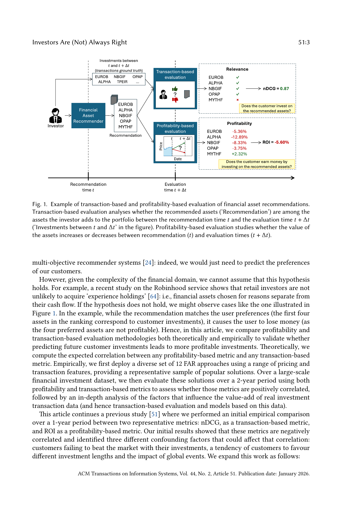

Transaction-based evaluation analyses whether the recommended assets ('Recommendation') are among the assets the investor adds to the portfolio between the recommendation time *t* and the evaluation time *t + dt* ('Investments between *t* and *dt*' in the figure). Profitability-based evaluation studies whether the value of the assets increases or decreases between recommendation (*t*) and evaluation times (*t + dt*).

Given the increasing customer demand on personalised services in the financial sector [Kibble2020], an ideal financial asset recommendation algorithm would optimise both perspectives: the profitability of the ranked items and their likeness to be acquired by the different investors. Equally, both evaluation perspectives should be considered when testing the effectiveness of FAR models. However, previous works [Chalidabhongse2006, Lee2014, Matsatsinis2009, Musto2015b, SanzCruzado2024, Zhao2015, Zheng2020] focused only on one of these perspectives, neglecting the impact recommendations might have on the other. If customers invest intelligently, and thereby profit from the market, a high correlation between these two metric families would be expected: in that case, making transaction-based evaluation superior, as it would not only be able to measure profitability, but also incorporate the customer preferences. This would allow us to evaluate FAR models based only on one family of metrics and avoid the complexities of multi-objective recommender systems [Jannach2023]: indeed, we would just need to predict the preferences of our customers.

However, given the complexity of the financial domain, we cannot assume that this hypothesis holds. For example, a recent study on the Robinhood service shows that retail investors are not unlikely to acquire 'experience holdings' [Welch2022]: i.e., financial assets chosen for reasons separate from their cash flow. If the hypothesis does not hold, we might observe cases like the one illustrated in Figure 1. In the example, while the recommendation matches the user preferences (the first four assets in the ranking correspond to customer investments), it causes the user to lose money (as the four preferred assets are not profitable). Hence, in this article, we compare profitability and transaction-based evaluation methodologies both theoretically and empirically to validate whether predicting future customer investments leads to more profitable investments. Theoretically, we compute the expected correlation between any profitability-based metric and any transaction-based metric. Empirically, we first deploy a diverse set of 12 FAR approaches using a range of pricing and transaction features, providing a representative sample of popular solutions. Over a large-scale financial investment dataset, we then evaluate these solutions over a 2-year period using both profitability and transaction-based metrics to assess whether those metrics are positively correlated, followed by an in-depth analysis of the factors that influence the value-add of real investment transaction data (and hence transaction-based evaluation and models based on this data).

This article continues a previous study [SanzCruzado2022] where we performed an initial empirical comparison over a 1-year period between two representative metrics: nDCG, as a transaction-based metric, and ROI as a profitability-based metric. Our initial results showed that these metrics are negatively correlated and identified three different confounding factors that could affect that correlation: customers failing to beat the market with their investments, a tendency of customers to favour different investment lengths and the impact of global events. We expand this work as follows:

(1) We provide a theoretical analysis of the relation between transaction-based and profitability-based metrics.
(2) We extend our previous empirical analysis to a longer time period (2 years instead of 1) to cover diverse market conditions.
(3) We provide a deeper exploration of the three confounding variables, performing experiments to understand their effect on transaction-based metrics.

The primary contributions of this article are as follows:

(1) We formalise the properties that define transaction-based and profitability-based metrics for FAR evaluation. Using these properties, we mathematically prove that transaction-based metrics are independent from profitability-based metrics for the FAR task.
(2) We evaluate 12 FAR approaches over a recent real-world financial pricing and transaction dataset (spanning from January 2018 to November 2022), including profitability prediction, personalised collaborative filtering and hybrid strategies that are rarely compared. Our experiments demonstrate that approaches that leverage real customer transaction data perform poorly, and that, empirically, profitability and transaction-based evaluation metrics are negatively correlated.
(3) Through an in-depth analysis of model effectiveness and customer investment behaviour, we show that customer transactions are problematic as a source of evidence of financial assets, since customers are often unable to improve the market with their investments and success depends on a combination of the asset purchase time and the (largely unknown) asset holding time.

This work is organised as follows: In Section 3, we formalise the FAR task and introduce the basic notations we shall use throughout the article. Then, Section 2 summarises previous works on FAR, with a special focus on evaluation perspectives. Section 4 introduces the **research questions (RQs)** we address in this work. Section 5 formalises profitability-based and transaction-based metrics and analyses the theoretical relation between these metrics. Section 6 introduces the experimental setup for empirically comparing both perspectives with Section 7 reporting our empirical results. Afterwards, Sections 8 through 11 provide an in-depth analysis of the factors affecting the empirical correlation between different evaluation perspectives. Finally, we conclude our article in Section 12.

## 2. Related Work

### 2.1 FAR Approaches

The financial domain has inspired a wide variety of techniques for suggesting products on which to invest, based on many sources of information, including investment transactions, pricing data, news and social networks, among others. In our later experiments, we evaluate 12 different recommendation approaches from the literature; hence, we summarise the main classes of FAR approach below for reference.

#### 2.1.1 Price-Based Models

Price-based or asset-based recommenders are FAR algorithms that only consider asset-related information (e.g., prices, news) to suggest useful investments [SanzCruzado2024, Sun2018, Yang2018]. These methods consider the continuous changes in the market to suggest useful investments. Therefore, the nature of the data they leverage is dynamic over different points in time: prices change every few seconds when the markets are open, news refer to specific time points and so on. Since they only use data about financial assets, these algorithms ignore all available customer information, providing non-personalised suggestions [Zibriczky2016]. Due to the absence of standardised FAR datasets with access to customer information, this category encompasses the majority of previous FAR works.

The most representative group of algorithms (and the ones we deploy in this article) are the profitability prediction models. These approaches predict the future value of key performance indicators such as the assets' returns [Feng2019, Hsu2022, Paranjape2013, Yang2018]. The simplest methods in this category apply regression algorithms to estimate the values for each asset, based on prices, fundamental information and technical indicators. Algorithms considered for the task include linear regression [Yang2018], SVM [Hsu2022], multi-layer perceptrons [Quah1999] and LSTM [Alzaman2024]. More complex works addressed profitability prediction as a ranking task where, instead of just predicting the future value, they aim to identify the most profitable assets. Zheng et al. [Zheng2020] constitutes an example of these methods, which applies collaborative filtering to exploit similarities between pricing time series for its point-wise prediction. Other works applied pre-existing learning to rank [Liu2009] models such as LambdaRank or Deep RankNet for the task [Alsulmi2022, Alzaman2024]. Since these algorithms commonly require discrete relevance degrees instead of continuous target values, these works discretise the return values. In this vein, works like Feng et al. [Feng2019] considered point-wise and list-wise losses during their training process.

Finally, some papers have considered alternative information sources such as news, social media sentiment or knowledge graphs to develop asset recommendation methods. Song et al. [Song2017] trained ListNet and RankNet models to predict future returns of assets by leveraging pricing information and news sentiment. Meanwhile, Qin et al. [Qin2024], Sun et al. [Sun2018] and Tu et al. [Tu2018] estimated the growth of stocks from the aggregated sentiment of investors towards the stocks in social networks like StockTwits and Guba. Moreover, some works incorporated financial knowledge graph information into learning to rank methods for estimating asset returns [Feng2019, Hsu2022, Wu2024].

#### 2.1.2 Transaction-Based Recommendations

These models [Gonzales2022, Lee2014, Luef2020, Musto2015b, Zhao2015] use past customer transactions as the main source of information used to estimate the utility of the assets. These methods can integrate further information to generate recommendations and can be divided into five different categories depending on what information types they use: collaborative filtering, content-based, demographic, knowledge-based and social-based algorithms. In this work, due to data availability, we focus only on collaborative filtering and demographic models, but, for completion, we provide a brief description of past works in all these areas.

*Collaborative Filtering.* Recommenders are based on the principle that similar customers invest in similar assets, and similar assets are acquired by similar people [Ricci2022]. These methods require interactions between customers and assets (for example, transactions from investment logs). Some notable collaborative filtering methods have been developed for financial asset recommendation. First, Lee et al. [Lee2014] introduced a fairness-aware **matrix factorisation (MF)** method for suggesting loans to fund. They modified the MF approach with a BPR loss [Steffen2009] to drive lenders to less popular loans. Zhao et al. [Zhao2015] developed a loss function for probabilistic MF based on mean-variance portfolio optimisation [Markowitz1952]. Barreau and Laurent [Barreau2020] proposed the use of a convolutional network-based algorithm, which enhances the user and item embeddings with historical embeddings (averaging the embeddings of their last few transactions) for suggesting government bonds on which customers might wish to invest. They expanded their work in [Ghiye2023] to discount the utility of past customer interactions and give more importance to the most recent ones. Then, Bogaert et al. [Bogaert2019] applied user-based and item-based nearest neighbour models to recommend financial products to banking customers. Finally, Gonzales and Hargreaves [Gonzales2022] used the past behaviour of customers to cluster them into groups and train classic collaborative filtering methods for every group to recommend stocks.

*Content-Based.* Recommenders extract the investment preferences of customers based on a static analysis of assets that they have previously invested in, with the aim of identifying similar products that those customers have not seen before [Ricci2022]. As a representative algorithm in the financial domain, Luef et al. [Luef2020] designed an algorithm that first builds customer profiles according to static features such as the market sector or the lifecycle of the enterprises on which customers invested previously. Then, the customer profile is matched with the financial products using Jaccard similarity to rank those products.

*Demographic.* Recommenders consider personal information about customers as a means to identify similar investors [Ricci2022]. An example of these models in financial recommendation is the work by Takayanagi and Izumi [Takayanagi2024b], who incorporated domain-specific personality traits into neighbour models.

*Knowledge-Based.* Systems apply specific domain knowledge about how different items meet the user needs and preferences [Burke2007]. Several approaches have been proposed under this category for producing financial recommendations. Gonzalez et al. [Gonzalez2012] proposed an investment portfolio advisor based on fuzzy logic for matching customers and assets according to psychological and social characteristics, while Musto et al. [Musto2014, Musto2015, Musto2015b] designed investment portfolio case-based recommendation algorithms that factor in the risk aversion level of customers.

*Social-Based.* Recommenders [Tang2013] consider social connections (like follow relations in networks such as Twitter/X) to generate recommendations. For instance, Luef et al. [Luef2020] proposed a trust-aware strategy, where customers are required to specify other investors they trust, who could then be leveraged to identify assets to recommend.

#### 2.1.3 Hybrid Recommendations

These algorithms [Burke2007] combine several techniques and information sources to provide recommendations. This combination allows models to overcome the limitations of simple models. In the investment domain, a majority of the hybrid recommendation approaches combine past investment features with temporal information about the assets (e.g., prices, technical indicators) [Chalidabhongse2006, Matsatsinis2009, Swezey2018, Takayanagi2023, Takayanagi2023b].

An early work in this space was that of Chalidabhongse and Kaensar [Chalidabhongse2006], who trained an adaptive model to learn from past investments, financial technical indicators and demographic data about the customers. Matsatsinis and Manarolis [Matsatsinis2009] combined collaborative filtering and multi-criteria decision analysis to generate a utility score for equity fund recommendation. Yujun et al. [Yujun2016] proposed another one of these methods, formulated as a demographic **user-based kNN (UB kNN)** on which, instead of finding similarities between past investments, the answers to a risk assessment questionnaire are considered to determine whether pairs of customers are similar to each other. Then, the method re-ranks the assets according to the big order net inflow. Swezey and Charron [Swezey2018] re-ranked the outcome of a collaborative filtering MF approach using the weights obtained in a portfolio optimisation [Markowitz1952] process. Takayanagi et al. proposed two different deep learning models: first, in [Takayanagi2023], they combined an investor modelling module that learns from technical indicators, financial statements, business overviews and past customer transactions with a context module inspired by the NeuMF [He2017] model; and second, in [Takayanagi2023b], they considered historical tweets by investors as transactions and combined them with technical indicators to predict the interest of users in particular stocks. Finally, Lee et al. [Lee2024] proposed a model based on temporal graph convolutional networks that considers the profitability of the assets and the preferences of the users. For this, during training, they sample contrastive pairs using principles from mean-variance portfolio theory [Markowitz1952].

Other methods combined different types of data. For instance, Luef et al. [Luef2020] proposed a hybrid method that combines both the content-based and knowledge-based components. Later, Kubota et al. [Kubota2022] leveraged card transactions and mobile usage app statistics from customers to identify companies they have interacted with in the past and recommended these companies for potential stock investments.

As we can observe in this short review, many diverse algorithms have been proposed for financial asset recommendation. However, which approaches are the most effective is still largely unknown because the approach types are rarely compared, and as we will discuss next, there is little agreement on how success should be defined for these approaches. In our later experiments, we compare 12 distinct approaches, drawn from across the profitability prediction, collaborative filtering, demographic and hybrid classes (the other classes are omitted from the comparison due to cost or data unavailability).

### 2.2 Evaluating Financial Recommendations

In any research environment, a commonly agreed-upon and experimentally sound evaluation strategy for evaluating the different approaches is critical [Zangerle2023]. For the classical recommendation tasks, such as movie recommendation, researchers and practitioners have found that implicit interactions such as clicks on movies, or explicit ratings function well as a surrogate for whether a user is satisfied with a recommendation. However, in the financial domain, whether a customer will be satisfied with an asset is more difficult to measure, since it depends on more than the inherent properties of the asset, such as the market conditions and the amount of time the customer wants to invest for [Lee2024, McCreadie2022]. This complexity has resulted in a range of competing methods, namely: (i) transaction-based evaluation [Matsatsinis2009, Takayanagi2023, Zhao2015]; (ii) profitability/performance-based evaluation [Alzaman2024, Feng2019, Feng2022]; (iii) expert-based evaluation [Gonzalez2012, Luef2020]; as well as (iv) hybrid methods that combine one or more of these methods with additional aspects such as the customer's risk appetite or the asset class preferences [Yang2018, Zheng2020]. This lack of a standardised and agreed-upon evaluation method is problematic when evaluating systems, as prior works tend to only use one, or in rare cases, two of these methods. Hence, there is a clear need for research efforts to understand and standardise the use of these methods. Below, we summarise these evaluation methods and then discuss transaction and profitability-based evaluations in more detail in Section 4, as these are the focus of our study.

*Profitability/Performance Evaluation.* In FAR systems, the core goal of the customer is to maximise their profit. As it aligns with their goal, the real-world performance of recommended assets is a natural proxy to customer satisfaction. Metrics used under this type of evaluation attempt to quantify the benefits (or losses) that a customer might obtain by investing in a recommended asset. However, profitability is complex to measure, since even if we have future pricing data, when the customer will actually 'cash-out' is unknown. Because of this, it is common for these measures to be defined over a fixed period of time, which differs between previous works (from days [Alzaman2024, Zheng2020]) to years [SanzCruzado2024]). The primary limitation of this type of metrics is that it ignores the customer's situation, and it cannot measure the personalisation of the recommendations or consider the risk appetite of the investor [Zheng2020]. Performance is usually measured in three different ways:

- *Technical indicators:* Metrics within this category directly compute key performance indicators such as net profit or ROI over a fixed period of time. Depending on previous works, the key performance indicators are computed over a single date [Musto2014, Musto2015, SanzCruzado2024, Quah1999] or they are aggregated over multiple dates [Feng2019, Feng2022, Hsu2022, Sun2018, Tu2018].
- *Regression error:* In the case of regression models, it is possible to estimate the distance between the predicted returns and the real returns of the recommended assets using metrics such as **mean average error (MAE)** or **rooted mean squared error (RMSE)**. Several previous works apply these metrics [Alzaman2024, Feng2019, Feng2022, Yang2018]. However, these metrics are not useful for algorithms targeting objectives different from returns prediction.
- *Ranking metrics:* Finally, inspired by information retrieval, some previous works have adapted ranking-based metrics like precision, recall, nDCG or MRR to evaluate the profitability of assets. MRR is the most commonly used metric, computed in this space as the average reciprocal rank of the recommended assets in the ground truth profitability ranking [Feng2019, Feng2022, Hsu2022]. Similarly, Hsu et al. [Hsu2022] computed precision as the proportion of recommended assets in the top *k* positions of the ground truth ranking. Alternatively, Alsulmi [Alsulmi2022] adapted precision and nDCG by establishing multiple relevance degrees based on the profitability values of the assets.

In this article, we focus on the first family of performance-based metrics, those based on technical indicators, as they represent the most established metrics in the community. Our theoretical analysis also covers ranking metrics, but we leave their empirical study for future work. We chose to exclude error metrics from both our theoretical and empirical analyses for two reasons: first, not all tested approaches aim to predict future profitability/pricing of assets (providing an unfair advantage to methods that do so); second, we aim to provide a short list of recommended items to customers, and error metrics over the whole item set do not necessarily reflect algorithm performance at the top results [Cremonesi2010].

*Transaction-Based Evaluation.* For non-cold-start investors, their past transaction history containing buy and sell actions may be available. It has been hypothesised that these transactions are a good alternative measure for customer satisfaction, since if the customer chose to invest in something then this is a strong signal that they like it. Moreover, under the assumption that customers invest intelligently and hence make a profit, metrics based on these transactions should positively correlate with the profitability metrics. In this way, it is theorised that transaction-based evaluation is a superior method if such transaction data is available. Transaction-based evaluation re-uses metrics from the information retrieval domain, such as precision [Chalidabhongse2006, Matsatsinis2009, Zhao2015], recall [Matsatsinis2009, Zhao2015] and nDCG [Takayanagi2023, Zhao2015], among others. Notably, transaction-based evaluation is equivalent to classical recommendation evaluation using explicit interactions [Cañamares2017, Gunawardana2022], whereas the buy transactions are similar to positive ratings and the sell transactions are similar to negative ratings. In practice, transaction-based evaluation using non-synthetic data is still under-researched in the literature, primarily due to the lack of publicly available data (since logs of individual customer investments are naturally considered sensitive).

*Expert-Based Evaluation.* This method involves the participation of domain experts to establish what constitutes a good recommendation for a customer. Experts have a deep understanding of the prevailing market conditions, the historical asset performances and the different factors that might influence the market evolution. Consequently, they are capable of providing advice on the long- and short-term viability of investments. However, it can be difficult and costly to obtain access to such experts. There are many ways to leverage expert judgments for evaluation, such as comparing the recommended assets with the expert's asset selection using accuracy metrics such as precision, recall or F1 [Gonzalez2012]. Previous works have also experimented with manually showing recommendations to experts for their assessment [Swezey2018].

*Hybrid Evaluation.* Due to the multiple factors that influence what a customer might value in an asset, hybrid approaches have been proposed, which combine multiple asset, customer and market features together to produce a single score for an asset. A simple example is the Sharpe Ratio [Zheng2020], which represents a ratio between the profitability of a product and its volatility (risk). However, as we show from our literature survey in Table 1, these hybrid measures are rarely reported in the literature, likely due to the additional complexity when attempting to interpret such measures.

Of these four classes of evaluation methods, profitability/performance evaluation is by far the most frequently used method in the literature as shown in Table 1 (likely due to the high availability of asset pricing data). However, this method has clear limitations due to its customer-agnostic nature. On the other hand, transaction-based evaluation intuitively seems to be a more comprehensive metric, as it is based on real customer interactions. However, there are a number of caveats around whether this type of evaluation would be effective in practice: it assumes the customers are effective investors. Hence, in the remainder of this article, we investigate to what extent this is the case, by comparing how profitability and transaction-based metrics perform over a real pricing transaction dataset when evaluating a wide range of FAR approaches.

**Table 1: Comparison of Recommendation Techniques and Associated Evaluation Strategies Reported across 35 Research Papers**

| FAR approach | Transaction-based | Profitability-based | Expert-based | Hybrid |
|---|---|---|---|---|
| Price-based | | [2, 3, 14, 15, 22, 23, 44-46, 55, 57, 63, 66, 71] | | [3, 45, 66, 71] |
| Transaction-based | [4, 5, 16, 17, 30, 60, 70] | [17, 40-42] | [18, 33] | |
| Hybrid | [12, 29, 31, 36, 59, 61] | [31, 67] | [33, 58] | [31] |

## 3. Notations and FAR Task Definition

FAR systems are concerned with two groups of entities: the customers/users who are interested in investing (which we shall denote by u in U) and the financial assets/items they can invest in, (which we denote by i in I). At a given time, *t*, customers can purchase or sell the different financial assets at a given price, price(i, t), which varies over time according to supply and demand. We define by I_u(t) subset of I the set of financial assets a customer u has interacted with at some point before *t*. We divide this set into two subsets: I_u^+(t) and I_u^-(t), representing, respectively, the assets that u has bought and sold before t. The goal of a FAR system is then to rank the available financial assets, R_u subset of I \ I_u(t) that are unknown to the customer u (i.e., those they have not interacted with in the past), based on their investment suitability (i.e., how adequate an asset might be for a customer).

## 4. Problem Formulation

Following the definition of the transaction-based and performance-based evaluation perspectives in Section 2.2, it is clear that they represent complementary strategies for assessing the quality of investment recommendations. Therefore, an ideal FAR system should target the optimisation of both angles: helping customers increase the money they earn from their investments while tailoring recommendations to their individual preferences.

Table 1 illustrates the evaluation methodology of 35 FAR algorithms from the literature. Each row represents a family of algorithms, whereas every column represents an evaluation perspective. By observing the table, it is possible to observe the fragmentation of the evaluation procedures: the transaction-based and hybrid strategies typically evaluate their ability to predict future customer investments (transaction-based evaluation), whereas the price-based methods are mainly assessed by their capability to recommend profitable assets (performance-based evaluation). Although the use of both evaluation perspectives results in a more complete analysis of the recommendations' utility, only Gonzales and Hargreaves [Gonzales2022] and Lee et al. [Lee2024] reported both perspectives: in the first case, profitability-based evaluation is only used to check whether their best algorithm in terms of MAP@10 provides profitable recommendations, but it is not compared to others regarding profitability; in the second study, both perspectives are evaluated for the whole set of tested models.

In a hypothetical scenario where both evaluation perspectives were highly correlated, we would be able to focus on a single group of evaluation metrics: by identifying the set of assets in which customers were interested, we would be able to suggest profitable investments and vice-versa. However, whether there is a relation between these two perspectives still needs to be established. We therefore explore the relation between profitability and transaction-based evaluation from both theoretical and empirical points of view. First, we explore the theoretical expectations in the relation between both groups of metrics. Afterwards, we experimentally compare financial asset recommendation algorithms targeting each of the perspectives and provide an empirical analysis of the relation between the two families of metrics. Finally, we explore which factors affect the relation between the metrics.

Overall, this article investigates three RQ:

- *RQ1:* What is the theoretical relation between transaction-based and profitability-based metrics for evaluating financial asset recommendation systems?
- *RQ2:* What is the empirical relation between transaction-based and profitability-based metrics for evaluating financial asset recommendation systems?
- *RQ3:* What are the main factors that influence transaction-based metrics?

Section 5 explores RQ1. The experimental setup for our empirical experiments is provided in Section 6. Then, Sections 7 and 8 answer the empirical RQ, RQ2 and RQ3, respectively.

## 5. RQ1: Theoretical Analysis

In this section, we explore the relation between relevance-oriented transaction-based metrics such as nDCG, precision and recall and profitability-based metrics such as ROI from a theoretical viewpoint. We aim to gauge whether there are any theoretical guarantees on the correlation between the two families of metrics. In the case those guarantees existed, they could support the hypothesis that developing algorithms improving one of the evaluation perspectives also improves the other. To perform such a theoretical analysis, we first provide formal definitions for the evaluation metrics in the context of financial asset recommendations.

**Definition 5.1.** An *evaluation metric* is a function m : U x R x T x R+ -> R, where U represents the set of all possible customers, R represents the set of permutations of assets I, T represents the possible timestamps where a recommendation can be provided to the customer and the fourth element R+ is the length of the test period.

In this theoretical analysis, we assume that all customers are different and, therefore, invest on different sets of assets. Therefore, given a time point *t* and a time horizon dt, a customer u in U is unequivocally defined by two sets: (a) the set of assets in which u has invested before time *t*, I_u(t) subset of I and (b) the set of acquisitions in the following time period (t, t + dt): I_u^+(t + dt) \ I_u(t) subset of I. Although in empirical scenarios several investors might share the same past and future transactions, this assumption is reasonable from a theoretical perspective. As we shall prove later, the studied metric values only depend on these two sets.

**Table 2: Summary of the Notations Used in the Theoretical Analysis**

| Notation | Meaning |
|---|---|
| U | Set of customers |
| I | Set of financial assets |
| T | Set of all possible timestamps |
| I_u(t) | Set of financial assets a user u in U has interacted before time t |
| I_u^+(t) | Set of financial assets a user u in U has acquired before time t |
| I_u^-(t) | Set of financial assets a user u in U has sold before time t |
| R | Set of all possible rankings (permutations of assets in I) |
| R@k | Set of all possible rankings of size k that can be built from I |
| m | Evaluation metric |
| m(u, R, t, dt) | Value of a metric for a user u in U, and a ranking R in the test period (t, t + dt) |
| m@k | Metric at cutoff k |
| \|S\| | Number of elements in set S |
| rel_u(t, dt) = I^+(t + dt) \ I_u(t) | Relevant assets for user u in U in the time period between t and t + dt |
| price(i, t) | Value of an asset i in I at time t |
| p(i, t, dt) | Performance function of asset i for a profitability-based metric |

Definition 5.1 applies to any metric we can use for the evaluation of FAR algorithms, regardless of its nature or the underlying information it uses. For instance, nDCG(u, R_u, t, dt) indicates the value of the transaction-based nDCG metric [Jarvelin2002] for customer u when we serve this customer the recommendation R_u at time *t*, and take all the information in the (t, t + dt) period as test, with dt representing the length of the test period. In the recommender systems field, however, it is uncommon to consider the full ranking in the evaluation process [Cañamares2017, Gunawardana2022]. Customers typically see a small fraction of the recommendation ranking, containing the top recommended assets. Hence, it is common to apply a rank cutoff to the recommendation ranking in the evaluation process. We therefore provide a formal definition for a metric at cutoff *k*:

**Definition 5.2.** Given k in N, an *evaluation metric at cutoff k* is a function m@k, where m@k : U x R@k x T x R+ -> R where R@k is the set of possible rankings of size *k* that can be built from I (all the possible permutations of *k* different elements taken from I).

Following the previous example, nDCG@10 indicates the value of the nDCG metric [Jarvelin2002] when we explore only the top 10 assets in the recommendation ranking. In this work, following common practice in the recommender systems community, we consider only metrics with cutoffs. If a ranking R with more than *k* elements is provided to a metric at cutoff *k*, we shall assume the metric only considers the first *k* elements.

In the rest of this section, we shall provide formal definitions for the properties that the transaction-based and performance-based metrics we compare in this article must satisfy. Then, we shall explore the theoretical relation between the two families of metrics. We summarise in Table 2 all the notations that we shall use throughout this section.

### 5.1 Transaction-Based Metrics

We first provide a definition for the properties that a transaction-based metric has to satisfy. Transaction-based metrics provide an estimate of the relevance of the recommendation ranking for the users. Most of the metrics within this category were originally devised for information retrieval: e.g., precision, recall, reciprocal rank, average precision, or nDCG. In order to formalise these metrics, we first need to provide a definition of the relevance of an asset:

**Definition 5.3.** An asset i is *relevant* for user u in the (t, t+dt) period if i in I_u^+(t+dt) \ I_u(t), i.e., if the customer acquires i for the first time in the test period (t, t + dt). We denote the relevant set of assets for a customer u between t and t + dt as rel_u(t, dt) = I_u^+(t + dt) \ I_u(t).

Considering this notion of relevance, we can now formalise the fundamental properties of transaction-based metrics. For the task, we take the work by Moffat [Moffat2013] as a foundation. However, there are two differences in our formalisation: first, we do not consider graded notions of relevance [Jarvelin2002]; second, where the properties proposed by Moffat [Moffat2013] represent those that an ideal information retrieval metric should satisfy, we aim to define properties that any relevance-based metric must satisfy: therefore we define less restrictive properties. We divide our properties in three categories: relevance promotion, asset identity independence and **customer equivalence (CE)** properties.

#### 5.1.1 Relevance Promotion Properties

The first set of properties focuses on the position of relevant assets in the recommendation ranking. The basic principle of these metrics indicates that having relevant assets in the ranking is better than not having them, and the closer those relevant assets are to the top positions of the ranking, the better. We consider two properties within this category:

- **Inter-ranking relevance promotion (InterRP):** Given fixed u, t, dt, and given l in N with 1 <= l <= k and two recommendation rankings, R^1, R^2 subset of I \ I_u(t) with R^j = [i_1^j, ..., i_k^j] such that i_n^1 = i_n^2 for n != l. If i_l^1 is relevant (i_l^1 in rel_u(t, dt)) and i_l^2 is not (i_l^2 not in rel_u(t, dt)), then, m@k(u, R^1, t, dt) > m@k(u, R^2, t, dt). This property ensures that evaluation metrics favour recommendation rankings with a larger number of relevant assets in the top ranks. To do this, it indicates that, if a non-relevant asset in the ranking is swapped with a relevant asset, the value of the metric shall increase. Moffat [Moffat2013] refers to this property as convergence.

- **Intra-ranking relevance promotion (IntraRP):** Given fixed u, t, dt, and given l_1, l_2 in N with 1 <= l_1 < l_2 <= k and two recommendation rankings R^1, R^2 subset of I \ I_u(t) with R^j = [i_1^j, ..., i_k^j], such that i_n^1 = i_n^2 for n != l_1, l_2 and i_{l_1}^1 = i_{l_2}^2 = j_1 and i_{l_2}^1 = i_{l_1}^2 = j_2. If j_1 is relevant (j_1 in rel_u(t, dt)) and j_2 is not (j_2 not in rel_u(t, dt)), then, m@k(u, R^1, t, dt) >= m@k(u, R^2, t, dt). This property is a relaxed version of the top-weightedness property defined in [Moffat2013] and favours the presence of relevant assets in the first positions in the ranking: at least, moving a relevant asset from lower positions in the ranking to higher positions does not diminish the value of the metric. The original version of the property establishes a strict increase in the metric when this occurs, but, as this effectively excludes well-known metrics such as precision or recall, we apply a more relaxed version in this work to define the properties of a transaction-based metric.

#### 5.1.2 Asset Identity Independence Properties

This group of properties ensures that the value of the metric only depends on the relevance judgments and not on the identity of the assets. They are meant to prevent unfair situations where an asset is given more importance than others with the same relevance for its particular characteristics. Instead, the value of a transaction-based metric should only depend on the number of relevant assets and their position in the recommendation ranking. We define two properties in this category that a transaction-based evaluation metric must fulfil:

- **Asset identity independence 1 (AII1):** Given fixed u, t, dt and two assets j_1, j_2 in I \ I_u(t) such that j_1 in rel_u(t, dt) implies j_2 in rel_u(t, dt) (i.e., they are either both relevant or both non-relevant for customer u). Given 1 <= l_1 < l_2 <= |I \ I_u(t)| and two recommendation rankings R^1, R^2 with R^j = [i_1^j, ..., i_{|I\I_u(t)|}^j] such that, for all n != l_1, l_2, i_n^1 = i_n^2, and i_{l_1}^1 = i_{l_2}^2 = j_1 and i_{l_2}^1 = i_{l_1}^2 = j_2. Then, m@k(u, R^1, t, dt) = m@k(u, R^2, t, dt). This property establishes that, given two equally relevant assets in the recommendation ranking, we can swap their positions without affecting the value of the metric.

- **Asset identity independence 2 (AII2):** Given fixed t and dt, let u, v be two customers such that I_u(t) = I_v(t) and |rel_u(t, dt)| = |rel_v(t, dt)|. Let j_u, j_v in I \ I_u(t) such that: j_u in rel_u(t, dt) (j_u is relevant for u); j_v in rel_v(t, dt) (j_v is relevant for v); rel_u(t, dt) \ rel_v(t, dt) = {j_u} (j_u is not relevant for v, and the rest of relevant assets for u are also relevant for v); rel_v(t, dt) \ rel_u(t, dt) = {j_v} (j_v is not relevant for u, and the rest of relevant assets for v are also relevant for u). Given 1 <= l_1 < l_2 <= |I \ I_u| and two recommendation rankings R_u, R_v subset of I \ I_u(t) with R_j = [i_1^j, ..., i_{|I\I_u(t)|}^j] such that: for all n != l_1, l_2, i_n^u = i_n^v, and i_{l_1}^u = j_u, i_{l_2}^u = j_v and i_{l_1}^v = j_v, i_{l_2}^v = j_u. Then, m@k(u, R_u, t, dt) = m@k(v, R_v, t, dt). This property establishes the behaviour of metrics when two customers differ on a single relevant asset (j_u being relevant to u and j_v being relevant to v). If we have two rankings differentiated only by a swap in the positions of j_u and j_v, the value of the metric for u and v, respectively, should be the same.

#### 5.1.3 CE

Finally, we define another property, which controls that, if we have two customers with the same relevance judgments (i.e., they both first invest on the same assets for the first time during the test period) and a ranking that can serve as a recommendation for both of them, then, the value of the metric for that ranking is the same for both users:

- **CE:** Given fixed t and dt, let u, v be two customers and i in I an asset such that I_u(t) = I_v(t) union {i} and rel_u(t, dt) = rel_v(t, dt). If there is a ranking R \ I_u(t) = R \ I_v(t) = R (i.e., it can be used as a recommendation for both u and v), then m@k(u, R, t, dt) = m@k(v, R, t, dt).

#### 5.1.4 Additional Properties

Given the previous set of properties, it is possible to prove that the value of a transaction-based metric depends only on (a) the position of the relevant assets in the ranking and (b) the number of relevant assets. This can be expressed through the following theorem:

**Theorem 5.4.** Given a transaction-based metric m, I a set of assets and a test period (t, dt). Let u, v in U be two customers and R_u = [i_1^u, ..., i_k^u] subset of I \ I_u(t), R_v = [i_1^v, ..., i_k^v] subset of I \ I_v(t) two recommendation rankings such that:

(1) For all l, i_l^u in rel_u(t, dt) iff i_l^v in rel_v(t, dt) (the asset in the lth position of ranking R_u is relevant for u if and only if the asset in the lth position of ranking R_v is relevant for v);
(2) |rel_u(t, dt)| = |rel_v(t, dt)| (the number of relevant assets is the same for both customers).

Then, m@k(u, R_u, t, dt) = m@k(v, R_v, t, dt).

**Proof.** For conciseness, we provide here a sketch of the proof. A thorough proof of this theorem is provided in Appendix A.1. In order to prove this theorem, we first need to simplify the conditions. To do this, we can use the CE property to find two equivalent customers, u', v' with I_{u'}(t) = I_{v'}(t) = empty set. For the proof, we gradually transform u and R_u into v and R_v making use of properties AII1 and AII2. Since AII1 and AII2 preserve the value of the metric, by only using these two properties, we prove that m@k(u, R_u, t, dt) = m@k(v, R_v, t, dt).

We shall use this theorem in Section 5.3 to provide a value of the correlation between transaction-based and profitability-based metrics.

### 5.2 Properties of Profitability-Based Metrics

We next formalise the definition of profitability-based metrics. This group of metric considers only pricing information to determine whether a recommendation is of good quality. Examples of performance-based metrics include the average return of investment or the average net profit, as well as more complex measures inspired from the information retrieval and recommender system domains [Hsu2022]. We only formalise here those metrics based on technical indicators and rankings: as previously mentioned, we leave the error metrics out of our formalisation, since they cannot be applied to all models. We provide the following definition for the profitability of an asset:

**Definition 5.5.** A recommended asset i is *profitable* if it increases its value in the (t, dt) time interval (with dt fixed), i.e., if price(i, t) < price(i, t + dt).

Profitability-based metrics often establish degrees of profitability for the different assets. These degrees are defined by a performance function p : I x T x R+ -> R, where I represents the set of assets, T the possible recommendation timestamps and the third element indicates the length of the evaluation period. The performance function needs to satisfy that, for every two assets i, j such that i is profitable (price(i, t + dt) > price(i, t)) and j is not (price(j, t + dt) <= price(j, t)), then p(i, t, dt) > p(j, t, dt). Every pricing-based metric has one of these performance functions associated to it. Examples include the net profit of the asset, the ROI or the ranking of the asset in the ground truth. In case the metric does not aim to compare different degrees of profitability, it is enough to define p as 1 when the asset is profitable, or as 0 when the asset is not profitable.

We can use this definition to provide multiple properties. We can differentiate two groups of properties: profitability promotion and **customer independence (CI)**.

#### 5.2.1 Profitability Promotion Properties

These metrics consider that good FAR algorithms should return the most profitable assets in the first positions of the ranking. We can define three metrics within this group:

- **Inter-ranking positive profitability promotion (Inter3P):** Given fixed u, t, dt, and given l in N with 1 <= l <= k and two recommendation rankings, R^1, R^2 subset of I \ I_u(t) with R^j = [i_1^j, ..., i_k^j] such that i_n^1 = i_n^2 for n != l. If i_l^1 is profitable and i_l^2 is not profitable, then m@k(u, R_1, t, dt) > m@k(u, R_2, t, dt). This property is equivalent to the InterRP we defined for the transaction-based metrics, but considering profitability instead of relevance. It ensures that, if we substitute in our recommendation ranking an asset losing money with another one increasing its value in the test set, then the value of the metric increases: i.e., the metric values recommendation rankings with profitable assets.

- **Inter-ranking higher profitability promotion (InterH2P):** Given fixed u, t, dt and given l in N with 1 <= l <= k, and two recommendation rankings, R^1, R^2 subset of I \ I_u(t) with R^j = [i_1^j, ..., i_k^j] such that i_n^1 = i_n^2 for n != l. If p(i_l^1, t, dt) >= p(i_l^2, t, dt), then m@k(u, R_1, t, dt) >= m@k(u, R_2, t, dt). This property ensures that the result of the metric does not decrease when we substitute an asset in the ranking by a similar or more profitable asset. The definition of the performance function p used here is not independent of the evaluation metric: we are referring here to the specific definition used for the metric.

- **Intra-ranking higher profitability promotion (IntraH2P):** Given fixed u, t, dt, and l_1, l_2 in N with 1 <= l_1 < l_2 <= k and two recommendation rankings R^1, R^2 subset of I \ I_u(t) with R^j = [i_1^j, ..., i_k^j] such that i_n^1 = i_n^2 for n != l_1, l_2 and j_1 = i_{l_1}^1 = i_{l_2}^2 and j_2 = i_{l_2}^1 = i_{l_1}^2. If p(j_1, t, dt) > p(j_2, t, dt), then m@k(u, R^1, t, dt) >= m@k(u, R^2, t, dt). This property, similarly to the IntraRP property of the transaction-based metrics, favours the presence of the most profitable assets in the top positions of the recommendation ranking.

#### 5.2.2 CI Properties

This group of properties establishes that the value of the profitability-based metrics must only depend on the price of the recommended assets and not on the customer who receives the recommendation. This is defined by the following property, which expects the score of the performance-based metric to be the same for two different users receiving the same recommendation:

- **CI:** Given fixed t and dt, if we have two customers, u, v and a recommendation ranking R = [i_1, ..., i_k] such that R subset of I \ I_u(t) and R subset of I \ I_v(t), then m@k(u, R, t, dt) = m@k(v, R, t, dt).

### 5.3 Theoretical Relation between Transaction-Based and Profitability-Based Metrics

We finally study whether there is a matching behaviour between the two families of metrics and whether we can use them interchangeably. Following the previously defined properties, it is possible to prove that, from a theoretical point of view, we cannot use them interchangeably. The reason is that, if we take one metric from each family, their values are independent. We formulate this in the following theorem:

**Theorem 5.6.** Given k >= 1, a fixed test period (t, t+dt) a set of financial assets I, and a transaction-based metric m_TB@k and a profitability-based metric m_PB@k. Over the set of all possible user-ranking pairs, m_TB@k and m_PB@k are independent (the correlation between m_TB@k and m_PB@k is 0).

**Proof.** We provide a simplified sketch of the proof. The complete proof is provided in Appendix A.2. In order to prove independence, we need to confirm that the theoretical correlation between the metrics is equal to 0, or, equivalently, prove that:

E[m_TB@k|t, dt] * E[m_PB@k|t, dt] = E[m_TB@k * m_PB@k|t, dt],

where the expected values (represented by E[*|t, dt]) are defined over the set of all possible customer-ranking pairs at time *t*, namely U_{R@k}(t):

U_{R@k}(t) = {(u, R) in U x R@k | R subset of I \ I_u(t)}.

To demonstrate this, we first use combinatorics to compute the size of U_{R@k}(t), which is:

|U_{R@k}(t)| = 2^k * 3^{|I|-k} * |R@k|.

Then, making use of the calculations leading to Equation (3) and the CI property of the profitability-based metrics, we demonstrate that the expected value of the profitability-based metric is as follows:

E[m_PB@k|t, dt] = (2^k * 3^{|I|-k}) / |U_{R@k}(t)| * sum over R in R@k of m_PB@k(R, t, dt).

To compute the expected value of the transaction-based metrics, we define S(R, j, t, dt) as the sum of the values of m_TR@k for a ranking R over the set of customers for which (a) R is a valid recommendation and (b) the customers' histories I_u(t) are of size j. Theorem 5.4 is then used to prove that S(R, j, t*dt) does not depend on R, i.e., for all R in R@k, S(R, j, t*dt) = S(j, t, dt). With this observation, the expected value can be defined as follows:

E[m_TR@k|t, dt] = |R@k| / |U_{R@k}(t)| * sum from j=1 to |I|-k of S(j, t, dt).

Finally, through reordering the sums and term substitutions, we demonstrate that the expected value of the product of the metrics is as follows:

E[m_TR@k * m_PB@k|t, dt] = 1/|U_{R@k}(t)| * [sum from j=1 to |I|-k of S(j, t, dt)] * [sum over R in R@k of m_PB@k(R, t, dt)],

thus proving our theorem.

To answer RQ1: *The previous theorem highlights that **there is no theoretical relation between any pair of transaction-based and profitability-based metrics**. Therefore, any recommendation optimising one perspective has no theoretical impact on (or neglects) the other.*

Despite this result, in realistic scenarios, multiple factors might affect the relation between the metrics, including the ability of the customers as investors, the target of recommendation algorithms, or the global market conditions. Therefore, in the following sections, we empirically investigate the relation between these two perspectives over real investment data.

## 6. Experimental Setup

The theoretical analysis in Section 5 formally demonstrated that the transaction and profitability-based metrics are independent from each other. To prove the lack of relation between the metrics, Theorem 5.6 considers the set of all possible customer-ranking pairs. However, in real-world scenarios, we commonly evaluate our systems using a limited dataset, which covers only a tiny fraction of the potential customers, and a selection of recommendation models.

In the case that all the customers selected their investments randomly, we would expect our theoretical analysis to hold in real-world scenarios. However, we cannot assume this, since customers choose what assets they want to buy and sell according to their needs, and preferences as well as suggestions from their financial advisors. Since these investments are not made randomly, they can introduce systematic biases in the data [Marlin2007] such as popularity or discovery bias [Cañamares2017, Cañamares2018, Steck2011]. Moreover, the recommendation algorithms limit their exploration space based on their training process and their target (and this exploration might also be affected by the previously mentioned biases). Hence, it is necessary to analyse the relation between the metrics using real investment data.

Therefore, we perform a comparison study of 12 FAR approaches using a real large-scale financial asset pricing and transaction dataset. In this section, we summarise this dataset and its statistics, the cleaning techniques employed, how we split this dataset into temporal settings, as well as discuss the FAR approaches deployed and the evaluation metrics used. We report our results and primary analysis in Section 7.

### 6.1 Dataset

*Pricing and Transaction Data.* One of the novelties of this work is that we compare both (personalised) collaborative filtering and demographic-based recommenders to (un-personalised) asset-based recommenders that are more common in the financial domain. To enable this comparison, we require a dataset that provides (real) financial transaction data. Hence, we use FAR-Trans [SanzCruzado2024], a financial asset recommendation dataset collected from a large European financial institution. This dataset represents a 5-year snapshot of the Greek market, and covers a range of different assets: stocks, bonds and mutual funds for the period between January 2018 and November 2022, inclusive. In addition to asset pricing data for that period, the dataset also includes investment transaction logs (asset buy and sell actions) handled by the institution. Table 3 summarises the characteristics of the dataset.

**Table 3: Dataset Description**

| Market data | | Customer data | |
|---|---|---|---|
| **Property** | **Value** | **Property** | **Value** |
| Unique assets | 806 | Unique customers | 29,090 |
| Assets with investments | 321 | Transactions (unique) | 388,049 (154,103) |
| Price data points | 703,303 | Acquisitions (unique) | 228,913 (89,884) |
| Average return (by assets, whole period) | 37.16% | Average return (by customers, whole period) | 22.89% |
| % profitable assets | 54.28% | % customers with profits | 54.56% |

*Dataset Cleaning (Pre-Split).* Collaborative filtering algorithms typically receive as input a rating matrix where each user-item pair is represented by a numerical value representing the interest of the user in the item. In our experiments, we consider that a customer has an interest in a financial asset (Rel(u, i) = 1.0) if they have acquired instances of the asset. Otherwise, it is considered that the customer is not interested in that product (Rel(u, i) = 0.0). Whether a customer has acquired instances of an asset for training/testing each model is determined by the temporal split, discussed next.

*Dataset Temporal Splitting.* This dataset spans 59 months (almost 5 years). The effectiveness of different recommendation algorithms will naturally vary as market conditions change (as we will show later). Hence, it is important to examine how performance varies over time if we are to gauge more accurately when and where different recommendation strategies succeed and/or fail. To this end, we divide our dataset into 61 distinct variants, each representing a recommendation setting for a different point in time. Each variant defines a time point *t* when recommendations are produced, *t* in T, with pricing data and investment transactions recorded prior to *t* available for model training/validation, and the pricing data and investment transactions made after *t* being used for evaluating the resulting recommendations. To avoid contamination of the test set, if a customer has acquired an asset during both the training and test periods, we only keep the interactions in the training set. Our first time point t_1 is the 1st of August 2019 (providing 1.5 years worth of training data in the first instance, starting from January 2018). Time points t in T are spaced 2 weeks apart, so t_2 is mid-August 2019, t_3 is the beginning of September 2019 and so on, until the end of November 2021. In total, our dataset variants allow us to explore changing market conditions over a period of 2 years and 4 months. We illustrate this process in Figure 2. When reporting results, we chart the recommendation model performance over time for all 61 time points.

**Figure 2: Dataset temporal split procedure.**

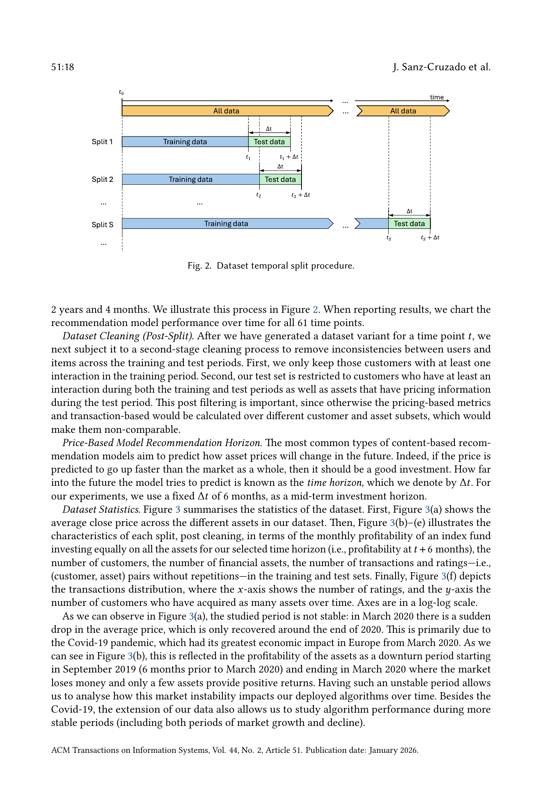

*Dataset Cleaning (Post-Split).* After we have generated a dataset variant for a time point *t*, we next subject it to a second-stage cleaning process to remove inconsistencies between users and items across the training and test periods. First, we only keep those customers with at least one interaction in the training period. Second, our test set is restricted to customers who have at least an interaction during both the training and test periods as well as assets that have pricing information during the test period. This post filtering is important, since otherwise the pricing-based metrics and transaction-based would be calculated over different customer and asset subsets, which would make them non-comparable.

*Price-Based Model Recommendation Horizon.* The most common types of content-based recommendation models aim to predict how asset prices will change in the future. Indeed, if the price is predicted to go up faster than the market as a whole, then it should be a good investment. How far into the future the model tries to predict is known as the *time horizon*, which we denote by dt. For our experiments, we use a fixed dt of 6 months, as a mid-term investment horizon.

*Dataset Statistics.* Figure 3 summarises the statistics of the dataset. First, Figure 3(a) shows the average close price across the different assets in our dataset. Then, Figure 3(b) through (e) illustrates the characteristics of each split, post cleaning, in terms of the monthly profitability of an index fund investing equally on all the assets for our selected time horizon (i.e., profitability at t + 6 months), the number of customers, the number of financial assets, the number of transactions and ratings (i.e., (customer, asset) pairs without repetitions) in the training and test sets. Finally, Figure 3(f) depicts the transactions distribution, where the x-axis shows the number of ratings, and the y-axis the number of customers who have acquired as many assets over time. Axes are in a log-log scale.

**Figure 3: Basic properties of the dataset for a dt = 6 months investment horizon.**

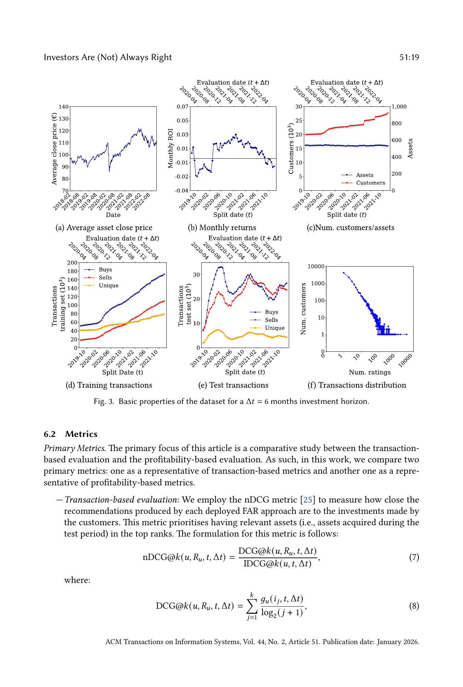

| (a) Average asset close price | (b) Monthly returns | (c) Num. customers/assets |
|---|---|---|
| (d) Training transactions | (e) Test transactions | (f) Transactions distribution |

As we can observe in Figure 3(a), the studied period is not stable: in March 2020 there is a sudden drop in the average price, which is only recovered around the end of 2020. This is primarily due to the Covid-19 pandemic, which had its greatest economic impact in Europe from March 2020. As we can see in Figure 3(b), this is reflected in the profitability of the assets as a downturn period starting in September 2019 (6 months prior to March 2020) and ending in March 2020 where the market loses money and only a few assets provide positive returns. Having such an unstable period allows us to analyse how this market instability impacts our deployed algorithms over time. Besides the Covid-19, the extension of our data also allows us to study algorithm performance during more stable periods (including both periods of market growth and decline).

### 6.2 Metrics

*Primary Metrics.* The primary focus of this article is a comparative study between the transaction-based evaluation and the profitability-based evaluation. As such, in this work, we compare two primary metrics: one as a representative of transaction-based metrics and another one as a representative of profitability-based metrics.

- *Transaction-based evaluation:* We employ the nDCG metric [Jarvelin2002] to measure how close the recommendations produced by each deployed FAR approach are to the investments made by the customers. This metric prioritises having relevant assets (i.e., assets acquired during the test period) in the top ranks. The formulation for this metric is as follows:

  nDCG@k(u, R_u, t, dt) = DCG@k(u, R_u, t, dt) / IDCG@k(u, t, dt),

  where:

  DCG@k(u, R_u, t, dt) = sum from j=1 to k of g_u(i_j, t, dt) / log_2(j + 1),

  and:

  IDCG@k(u, R', t, dt) = max over R' of DCG@k(u, R', t, dt),

  and g_u(i, t, dt) is the grade of relevance of item i for user u in the (t, t + dt) period, and i_j is the j-th item in ranking R_u. In this work, we consider g_u(i) = Rel(u, i), i.e. 1 if u acquires i during the test period and 0 otherwise (if i in I_u^+(t + dt) \ I_u(t)).

- *Profitability-based evaluation:* In our experiments we report the average ROI of the top-k recommended assets after a fixed time dt as our measure of profitability. Following the definition in Section 5, we define the performance function p as the ROI of the assets: the relative difference between the future and present prices of the asset:

  p(i, t, dt) = ROI(i, t, dt) = (price(i, t + dt) - price(i, t)) / price(i, t).

  By averaging the returns over the top-k recommended assets in a ranking R_u = [i_1, ..., i_k], this metric represents the profitability of a fund or portfolio on which we invest one euro on every asset:

  ROI@k(u, R_u, t, dt) = (1/k) * sum from j=1 to k of p(i_j, t, dt) = (1/k) * sum from j=1 to k of ROI(i_j, t, dt).

  However, this metric has a limitation: we cannot compare the results for this metric when we explore different time horizons. The common way to do this in finance is to convert the ROI into a return over a period of fixed length. Because of this, we choose a month as our fixed length period, and compute the monthly ROI, i.e., how much money the previously mentioned portfolio would make every month. This measure is defined as follows:

  Monthly ROI@k(u, R_u, t, dt) = (1 + ROI@k(u, R_u, t, dt))^{30/days(dt)} - 1,

  where days(dt) is the number of days covered in the (t, t + dt) period. We define a month as a 30-day period.

*Secondary Metrics.* In addition to the above primary metrics we also report the following secondary metrics to support our analysis in this article:

- *Profitable asset ratio (%prof):* The proportion of the top-k recommended assets with a ROI >= 0.
- *Volatility:* The standard deviation of the daily returns for an asset, averaged over the top-k recommended assets.

### 6.3 Algorithms

To provide a meaningful comparison of evaluation methods, we need to apply these methods over a range of different FAR approaches, hence, we deploy a diverse suite of 12 FAR approaches from the literature, including random recommendation, profitability prediction models, transaction-based models and hybrid models. We summarise them below:

- *Random recommendation:* As a simple, sanity-check baseline, we include an algorithm that randomly selects the assets to recommend.
- *Profitability-based models:* As representative algorithms, which only consider the pricing history of the assets, we test three regression approaches, predicting return at t + 6 months: linear regression, random forest and LightGBM regression, a method using gradient boosted regression trees [Guolin2017]. As features, we use a selection of technical analysis indicators. Technical analysis [Murphy1999] studies past prices and trade volumes of the assets to forecast future price trends. The indicators are heuristic values used by technical analysis, computed from past asset prices. In our work, we use indicators based on the closing price: average price, ROI, volatility, moving average convergence divergence, momentum, rate of change, relative strength index, **detrended price oscillator (DPO)**, ROI/volatility ratio, and maximum and minimum values over a time period prior to prediction. We include descriptions of these indicators in Table 4. Note that, in the table, the time period prior to the prediction is indicated in financial days (i.e., days in which the market is open, excluding weekends and certain holidays).
- *Transaction-based models:* We choose several methods exploiting investment transactions to generate recommendations. We divide these approaches into three categories:
  - *Non-personalised:* As a basic, non-personalised baseline, we consider a popularity-based recommender, which ranks assets according to the number of times they have been purchased in the past.
  - *Collaborative filtering:* As collaborative filtering methods, we deploy three proposals: LightGCN [He2020], MF [Rendle2020] and UB kNN [Nikolakopoulos2022]. We also add the Apriori **association rule mining (ARM)** algorithm [Agrawal1994], which identifies groups of assets which are commonly acquired together, and establishes rules for recommending assets according to the past investments of the customers.
  - *Demographic methods:* We add another method based on UB kNN, which instead of using the past customer transactions to compute the similarities between customers uses the demographic profile of the customers. In this case, our features are derived from a questionnaire regarding their risk appetite (similarly to [Yujun2016]). We denote this method by **customer profile similarity (CPS)**.
- *Hybrid methods:* Finally, we deploy two hybrid methods, based on gradient boosting regression trees [Guolin2017]: first, a regression LightGBM algorithm, targeting the profitability at 6 months in the future (Hybrid-regression), and, second, the LightGBM implementation of the LambdaMART learning to rank algorithm [Burges2010], optimising nDCG (Hybrid-nDCG). As features, we use the outcome of all the previous listed recommendation algorithms.

For each algorithm, we select as the optimal hyperparameters those maximising the ROI at 6 months at three dates: 1 April 2019, 1 October 2019 and 31 January 2020.

**Table 4: Technical Indicators Used on the Profitability Prediction Algorithms**

| Indicator | Equation | Time period dt (financial days) |
|---|---|---|
| Average price | avg(i, t, dt) = (1/dt) * sum from j=0 to dt of price(i, t - j) | 21, 63, 126 |
| ROI | ROI(i, t, dt) = (price(i, t) - price(i, t - dt)) / price(i, t - dt) | 1, 21, 63, 126 |
| Volatility | Vol(i, t, dt) = stdev({ROI(i, t, tau)}_{tau=t-dt+1}^{t}) | 21, 63, 126 |
| MACD | MACD(i, t, dt) = EMA(i, t, dt) - EMA(i, t, 12) | 26 |
| Momentum | Momentum(i, t, dt) = price(i, t) - price(i, t - 1, dt) | 21, 63, 126 |
| Rate of change | ROC(i, t, dt) = (price(i, t) - price(i, t - dt)) / price(i, t - dt) * 100 | 21, 63, 126 |
| Relative strength index | RSI(i, t, dt, c(t)) = ... | 14 |
| DPO | DPO(i, t, dt) = price(i, t - (dt/2 + 1)) - (1/dt) * sum price(i, t - j) | 22 |
| ROI/Volatility ratio | ROIVol(i, t, dt) = ROI(i, t, dt) / Vol(i, t, dt) | 21, 63, 126 |
| Maximum price | max(i, t, dt) = max({price(i, tau)}_{tau=t-dt}^{t}) | 21, 63, 126 |
| Minimum price | min(i, t, dt) = min({price(i, tau)}_{tau=t-dt}^{t}) | 21, 63, 126 |

## 7. RQ2: Empirical Comparison

Under the experimental setup described in Section 6, we explore the empirical relationship between two evaluation metrics (nDCG and ROI) when we deploy and compare 12 recommendation algorithms over real investment data. Our experiments aim to analyse whether, differently from the theoretical scenario described in Section 5, the transaction-based evaluation and performance-based evaluations are positively correlated. If the correlation were positive, it would mean that optimising the transaction-based metrics should lead to profitable recommendations: therefore simplifying algorithmic design as well as the evaluation.

To explore how nDCG and monthly ROI relate to each other, we analyse the correlation between the two metrics at cutoff k = 10. Results are reported in Figure 4, where we show two metric comparisons. First, Figure 4(a) contrasts the average nDCG@10 and monthly ROI@10 values of the different algorithms. In the figure, the x-axis indicates the nDCG@10 value for every algorithm (averaged over the different splits) and the y-axis indicates the monthly ROI. The dashed line indicates the trend line of the comparison and the horizontal dotted line the monthly ROI of the market. Meanwhile, Figure 4(b) visualises the Pearson correlations between all pairs of metrics described in Section 6.2. In order to compute those correlations, we first compute the metric values for every user, algorithm and dataset variant triplet (approximately 1.5 million values), and then we calculate the correlation between the metric pairs. Blue values represent a positive correlation coefficient whereas red values indicate negative correlations.

**Figure 4: Evaluation metrics comparison for a dt = 6 months investment horizon.**

| (a) nDCG@10 vs. Monthly ROI@10 | (b) Pearson correlation between metrics |
|---|---|
| 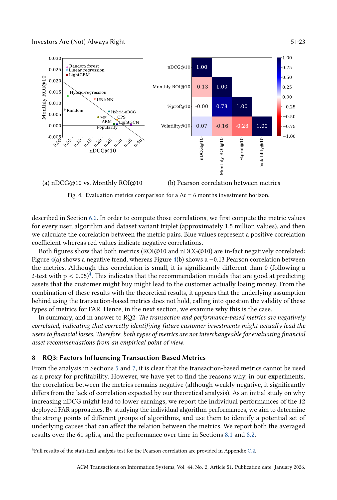 | |

Both figures show that both metrics (ROI@10 and nDCG@10) are in-fact negatively correlated: Figure 4(a) shows a negative trend, whereas Figure 4(b) shows a -0.13 Pearson correlation between the metrics. Although this correlation is small, it is significantly different than 0 (following a t-test with p < 0.05). This indicates that the recommendation models that are good at predicting assets that the customer might buy might lead to the customer actually losing money. From the combination of these results with the theoretical results, it appears that the underlying assumption behind the transaction-based metrics does not hold, calling into question the validity of these types of metrics for FAR. Hence, in the next section, we examine why this is the case.

In summary, and in answer to RQ2: *The transaction and performance-based metrics are negatively correlated, indicating that correctly identifying future customer investments might actually lead the users to financial losses. Therefore, both types of metrics are not interchangeable for evaluating financial asset recommendations from an empirical point of view.*

## 8. RQ3: Factors Influencing Transaction-Based Metrics

From the analysis in Sections 5 and 7, it is clear that the transaction-based metrics cannot be used as a proxy for profitability. However, we have yet to find the reasons why, in our experiments, the correlation between the metrics remains negative (although weakly negative, it significantly differs from the lack of correlation expected by our theoretical analysis). As an initial study on why increasing nDCG might lead to lower earnings, we report the individual performances of the 12 deployed FAR approaches. By studying the individual algorithm performances, we aim to determine the strong points of different groups of algorithms, and use them to identify a potential set of underlying causes that can affect the relation between the metrics. We report both the averaged results over the 61 splits, and the performance over time in Sections 8.1 and 8.2.

### 8.1 Averaged Performance

We first study the overall performance of the recommendation models, averaged over the 61 time splits. Table 5 reports the performance of all 12 deployed FAR approaches, where every column represents an evaluation metric averaged over all the considered time points. For further analysis, we do not just include nDCG@10 and Monthly ROI@10, but also the percentage of profitable assets (%prof@10) and the volatility of the recommended assets (Volatility@10). The highest performing model under each metric is highlighted in bold and underlined, and the performance distribution for each metric is colour coded (blue for highly performing and red for poorly performing). From Table 5, we observe the following key points.

**Table 5: Effectiveness of the Compared Models at Cutoff 10**

| Data source | Category | Algorithm | nDCG | Monthly ROI | %prof | Volatility |
|---|---|---|---|---|---|---|
| None | - | Random | 0.0106 | 0.0071 | 0.5009 | **0.2655** |
| Prices | Regression | Random forest | 0.0237 | **0.0259** | 0.5019 | 0.6094 |
| Prices | Regression | Linear regression | 0.0215 | 0.0249 | **0.5529** | 0.7283 |
| Prices | Regression | LightGBM | 0.0221 | 0.0225 | 0.4676 | 0.6073 |
| Transactions | Non-personalised | Popularity | 0.2710 | 0.0006 | 0.5302 | 0.4393 |
| Transactions | Collaborative filtering | LightGCN | **0.3404** | 0.0004 | 0.5022 | 0.4990 |
| Transactions | Collaborative filtering | ARM | 0.2556 | 0.0007 | 0.4744 | 0.5075 |
| Transactions | Collaborative filtering | MF | 0.1780 | 0.0038 | 0.5030 | 0.4728 |
| Transactions | Collaborative filtering | UB kNN | 0.1599 | 0.0119 | 0.5004 | 0.4265 |
| Transactions | Demographic | CPS | 0.2722 | 0.0026 | 0.5097 | 0.4647 |
| Hybrid | - | Hybrid-nDCG | 0.2313 | 0.0063 | 0.5170 | 0.4934 |
| Hybrid | - | Hybrid-regression | 0.0261 | 0.0132 | 0.5169 | 0.4613 |
| | Market average | | - | 0.0079 | 0.4624 | 0.2881 |
| | Customer average | | - | 0.0018 | 0.5504 | - |

A cell colour goes from red (lower) to blue (higher values) for each metric, with the top value both underlined and highlighted in bold. In the case of the monthly ROI, %prof and volatility, the blue cells indicate an improvement over the average market value.

First, we observe that, in general, all algorithms are capable of suggesting profitable assets (following the %prof@10 metric, on average over the 61 dates, between 46.7% and 55.3% of the recommended assets are profitable). However, if we consider the magnitudes of the profitability, only a few of the algorithms are able to provide a set of assets that improve the profitability over a market index (in blue in Table 5), namely the price-based algorithms, the hybrid model which optimises a profitability regression function and the UB kNN collaborative filtering algorithm. Among these algorithms, the best alternatives are notably the profitability prediction models, with the three of them (linear regression, random forest and LightGBM) beating the monthly profitability of the market by more than 180%. From these three models, the random forest regression appears as the best alternative, closely followed by the other two. However, these methods fail to identify assets in which customers are interested (achieving nDCG values barely above a random recommendation).

Second, the transaction-based algorithms are able to reasonably predict customer preferences (as shown by their high nDCG values). We observe that the algorithm with a highest nDCG value is the most advanced LightGCN algorithm. However, we can also see that the rest of the approaches are not able to clearly beat the non-personalised popularity-based recommendation algorithm. This suggests that the customers in our dataset tend to concentrate a large proportion of their investments into a small set of assets. Although collaborative filtering approaches achieve high nDCG values in our experiments, they show an overall poor performance in terms of the ROI (indeed, with the exception of UB kNN, all of them are close to 0 and underperform the market average). However, these methods can recommend several profitable assets, as indicated by the %prof metric, similar to the random forest algorithm.

Finally, when looking at the volatility metrics, we observe that only random recommendation achieves values below the average market volatility: the rest of the FAR algorithms recommend far more volatile assets than the market average. Profitability prediction algorithms are the ones choosing the most risky assets (with values between 0.6 and 0.72), whereas collaborative filtering methods, despite being high risk, recommend less volatile assets (volatility values between 0.42 and 0.51). This indicates that, although they do not provide profitable results, losses from collaborative filtering algorithms might be potentially lower than losses from the profitability prediction models as the ROI variation is lower.

The previous results highlight that those models ignoring customer preferences achieve better profitability than those using the customers' past history. Since the transaction-based methods are capable of identifying customer preferences on financial assets but their predicted returns are low, we hypothesise that one of the reasons that might explain the observed relation between the metrics is that our customers are suboptimal investors, unable to beat the market with their personal asset choices. We shall further investigate this hypothesis in Section 9.

### 8.2 Performance over Time

Although the numbers in Table 5 show a general overview of the recommendation effectiveness, a given algorithm's performance might vary when applied over different splits and time periods. Therefore, it is important to look not only at the broad average performance, but also at the performance of our recommendation algorithms on every split. Figure 5 shows the average performance of the different types of recommendation strategies (pricing-based, transaction-based or hybrid) over time divided in three charts for readability. The top row represents our primary transaction-based metric (nDCG@10) on the y-axis, while the bottom row represents the results for the profitability-based metric (Monthly ROI@10). In both rows, the x-axis value represents the split date. On each of the plots, the lighter areas represent the full range of values that a family of algorithms achieves at a given date. We include a more detailed plot illustrating the performance over time of each individual model in Appendix B. Furthermore, we include statistical significance tests for this experiment in Appendix C, comparing each pair of algorithms. The statistical tests (two-tailed Student's t-tests with p-value p < 0.05 and Bonferroni correction) were carried separately for each of the dataset variants.

**Figure 5: Comparison of performance reported by transaction-based nDCG@10 and profitability-based Monthly ROI@10 over time when considering a dt = 6 months investment horizon.**

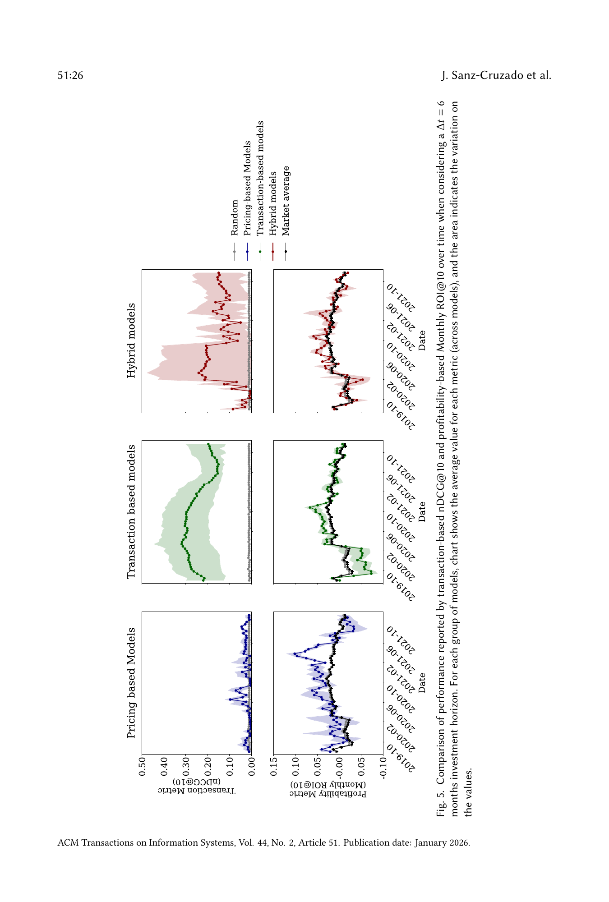

For each group of models, chart shows the average value for each metric (across models), and the area indicates the variation on the values.

As we can observe from the upper row of Figure 5, the nDCG comparison remains stable during the studied dates: the transaction-based models commonly achieve the highest values for the metric, and their ranking remains stable over different time splits. Only one of the hybrid models is capable of beating them at certain dates: the Hybrid-nDCG model in the period between February and September 2020. The interaction-based models consistently (following a two-tailed Student test with p-value p < 0.05, significantly) outperform the pricing-based models over the whole period.

A different trend appears, however, when we look at the monthly ROI values (the lower row of Figure 5). In this case, influenced by the fluctuation of market returns (represented in black in the different plots), the monthly ROI of the different algorithms notably varies. Overall, Figure 5 shows that the pricing-based approaches generally provide positive results over the market average. However, these models are not infallible, and some market conditions (like the market downturn at the beginning of 2022, represented in the last splits) can cause them to fail.

The interaction-based methods work differently: first, lossy periods for these models are commonly very severe, as it can be seen in the Covid-19 period between September 2019 and March 2020. During that period, assets recommended by the collaborative filtering algorithms experienced a 5% monthly decrease in their value. With the exception of the Covid-19 period, we observe that the collaborative filtering models appear to experience less fluctuations in returns between dates than the profitability prediction models. However, that also leads to a worse performance than those models for a majority of the studied period: the only times where the transaction-based models beat the price-based models are clearly shown at the end of the market downturn at the beginning of 2022. Overall, the profitability prediction models (random forest, LightGBM and linear regression) achieve improvements over all the collaborative filtering methods in more than half of the splits (at least in 36 out of 61 variants), and, in a majority of these cases, the difference is significant (two-tailed Student t-test with p < 0.05). This highlights the superiority of the profitability-based methods' performance in terms of monthly ROI.

However, there are also points in time where the collaborative filtering algorithms are able to beat the pricing-based models in terms of monthly ROI: something hidden when we average over the time splits (as seen in Section 8.1). Considering these changes and the variations in market behaviour over time, we hypothesise that the timing when a recommendation is presented to a customer influences the relation between the metrics (and therefore, there might be specific market conditions in which the transaction-based metrics provide a better global overview of the recommendation performance).

### 8.3 Conclusions

Following the analysis of the algorithmic performance of the deployed recommendation methods, we have identified two potential causes that explain why the transaction-based metrics are not sufficient to measure the utility of financial asset recommendations: (a) customers might be suboptimal and (b) recommendation time might act as a confounding variable due to the changes in the market conditions. Therefore, we propose the study of the following RQ:

- *RQ3.1:* How does the effectiveness of the customers affect the relation between the transaction-based and profitability-based metrics?
- *RQ3.2:* How do market changes affect the relation between the transaction-based and profitability-based metrics?

In addition, since we are considering time as a potential confounding factor, we also need to assess the importance of the investment horizon: the amount of time our investors hold their assets. The reason behind this is that selling financial assets at different moments in time might also affect the profitability of our recommendations. Hence, we also aim to answer the following research question:

- *RQ3.3:* How does the customer's investment horizon affect the relation between the transaction-based and profitability-based metrics?

In the following, we explore question RQ3.1 in Section 9, RQ3.2 in Section 10 and RQ3.3 in Section 11.

## 9. Effectiveness of Customers as Investors

The first hypothesis for why the transaction-based metrics perform poorly (and also why the models trained with transaction-based data do not make money) questions the capacity of our customers to effectively navigate the market and invest in profitable assets. If our customers were effective investors (they earned money on average), identifying those items they might be interested in investing on should lead to profitability. However, the opposite also stands: if our customers were bad investors and they lost money from their investments, identifying those assets they might choose to invest on might lead to even further losses. As the correlation between nDCG and ROI is negative, we hypothesise that, on average, our customers belong to the second group.

### 9.1 Dataset Analysis

We can evaluate the investment skills of our investors by comparing the ROI of our customers over time against the market. If our customer investments are under-performing the market, then this would explain the negative correlation between the transaction-based and profitability-based metrics. To analyse this, we compute the monthly ROI obtained by customers in the 6 months following each of the split points in our dataset.

Table 6 shows a comparison between customers and assets. The first two columns show the average and median profitability of the market (first row) and customers (second row) in terms of monthly ROI, while the last column shows, respectively, the proportion of assets increasing their values, and the number of customers whose portfolio increases in value. All numbers are averaged over the 61 split points. Results in the table show that, although a majority of customers (55%) earn money from their investments, on average (and median), they are not performing better than the market (0.18% vs. 0.43% monthly ROI on average, 0.135% vs. 0.143% on median).

**Table 6: Comparison between the Profitability of Assets and Customers in Terms of Monthly ROI, Averaged over the Different Time Splits**

| | Average monthly ROI | Median monthly ROI | % profitable |
|---|---|---|---|
| Assets | 0.004259 | 0.001433 | 46.2447% |
| Customers | 0.001776 | 0.001356 | 55.0379% |

We expand this analysis in Figure 6 by analysing the evolution of these differences over time. In the three figures, the x-axis indicates the time of the split, whereas the upper axis shows the target date (6 months after the split), whereas the y-axis shows the metric value. The red curves indicate the customer values, whereas the blue curves show the market values. Figure 6(a) and (b) illustrates the average and median monthly ROI for the market and customers, whereas Figure 6(c) compares the proportion of profitable assets in the market with respect to the proportion of profitable investments of the customers.

**Figure 6: Split by split comparison between customer and market performance (dt = 6 months investment horizon).**

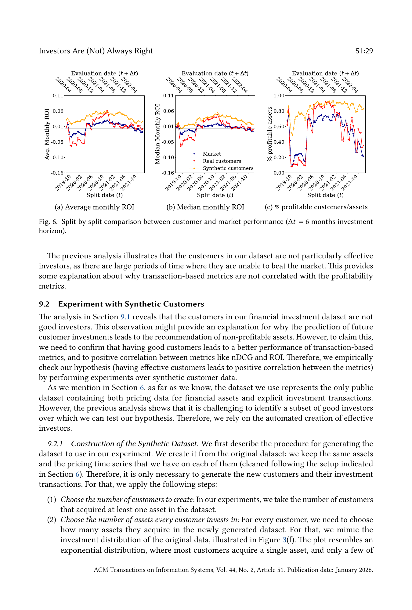

| (a) Average monthly ROI | (b) Median monthly ROI | (c) % profitable customers/assets |
|---|---|---|

Figure 6(c) shows that, even in the worst moments for the market (the period between October 2019 and March 2020), there are some winner assets, which provide profitability to investors (at least, 10% of the assets in the market). However, from the three figures, we also observe that the capacity of customers to identify those winning assets is not consistent over time. First, during the period between September 2019 and March 2020 where the market loses money (the Covid-19 period), the customer's curve lies notably below the market (customers lose up to a 6% of their investments every month vs. at most 3% monthly loss of the market). Customers have a notorious advantage over the market in the period between June 2020 and January 2021 (achieving up to a 6% profitability against a 3% of the market). Then, for the final period, we observe that customers are unable to beat the market during the period of deceleration where the market still increases its value, but at a slower pace (January to June 2021) and then they regain some advantage during the actual downturn of the market starting in August 2021.

The previous analysis illustrates that the customers in our dataset are not particularly effective investors, as there are large periods of time where they are unable to beat the market. This provides some explanation about why transaction-based metrics are not correlated with the profitability metrics.

### 9.2 Experiment with Synthetic Customers

The analysis in Section 9.1 reveals that the customers in our financial investment dataset are not good investors. This observation might provide an explanation for why the prediction of future customer investments leads to the recommendation of non-profitable assets. However, to claim this, we need to confirm that having good customers leads to a better performance of transaction-based metrics, and to positive correlation between metrics like nDCG and ROI. Therefore, we empirically check our hypothesis (having effective customers leads to positive correlation between the metrics) by performing experiments over synthetic customer data.

#### 9.2.1 Construction of the Synthetic Dataset

We first describe the procedure for generating the dataset to use in our experiment. We create it from the original dataset: we keep the same assets and the pricing time series that we have on each of them (cleaned following the setup indicated in Section 6). Therefore, it is only necessary to generate the new customers and their investment transactions. For that, we apply the following steps:

(1) *Choose the number of customers to create:* In our experiments, we take the number of customers that acquired at least one asset in the dataset.
(2) *Choose the number of assets every customer invests in:* For every customer, we need to choose how many assets they acquire in the newly generated dataset. For that, we mimic the investment distribution of the original data, illustrated in Figure 3(f). The plot resembles an exponential distribution, where most customers acquire a single asset, and only a few of them acquire higher numbers of assets. We model it using a generalisation of the exponential distribution: a Gamma distribution Gamma(k, theta), where k and theta represent, respectively, its shape and scale parameters. We obtain these parameters from the rating distribution of the original dataset, trying to preserve both its mean and variance.
(3) *Choose the time points of the investments:* For every investment, we need to generate the moment in time at which the customer invests on an asset. We pick this time point uniformly from the time interval between the beginning of the dataset and the end of the dataset.
(4) *Choose the assets in which to invest:* Finally, we need to select the assets our customers acquire. We aim to create effective investors, hence we need to choose profitable assets for our synthetic customers. For a customer u and time t, we choose an asset among the top n assets with higher ROI between t and t + dt (where dt is the investment horizon, equal to 6 months in our experiments). By selecting a fixed number of assets from which to choose, we pursue a double objective: (a) we only select among the most profitable assets, and (b) we ensure some clustering between the customers, allowing collaborative filtering algorithms to work. From those top n assets, the probability of choosing an asset is proportional to its ROI. In our experiments, we take n = 50.

Finally, we add to the new dataset the investment, and a sell transaction for the same customer and asset at time t + dt.

#### 9.2.2 Experimental Setup

We keep the experimental setup described in Section 6, where we study the effectiveness of multiple recommendation algorithms over 61 temporal splits. The main difference in our experiments is the substitution of the real customers by our synthetic investors, generated by the procedure defined in Section 9.2.1. Since the synthetic generation procedure is subject to randomness, we generate 10 synthetic datasets to mitigate the variance. We conduct our experiments over each of them, and report the average values.

In our experiments, we use the same algorithms, features, hyper-parameter settings and evaluation metrics as in the original experiment with one difference: since we do not have demographic data for our synthetic customers, we do not use the CPS algorithm in our new experiments.

#### 9.2.3 Results

We aim to confirm the hypothesis that, if we have effective investors as customers, the correlation between the profitability and transaction-based metrics should be positive. Since our synthetic datasets contain a majority of effective investors, we evaluate the outcome of the FAR algorithms over them, and compare the nDCG@10 and monthly ROI@10 metric values, similarly to what we did in Section 7. Then, we just need to check whether the correlation between metrics is positive.

We report a comparison between the predicted asset profitability (ROI@10) and the customers' preferences (nDCG@10) in Figure 7(a). As can be seen from the figure, when using our (more) effective synthetic investors, the trend line now has a positive slope, illustrating that the profitability and customer preference have indeed become positively correlated, as we hypothesised. To quantify this, Figure 7(b) presents a metric correlation matrix (Pearson correlation) for the experiment. From this figure, we observe that the correlation between profitability (ROI@10) and customer preferences (nDCG@10) is positive, at 0.13. However, this correlation is still weak, indicating that there are likely other factors that make profitability and customer preferences different when investing.

**Figure 7: Evaluation metric comparison over the synthetic datasets.**

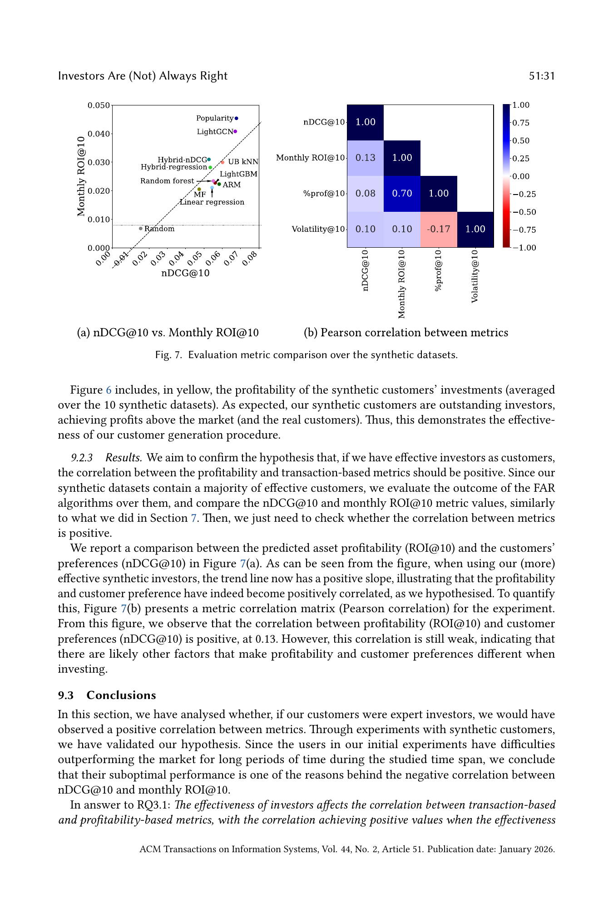

| (a) nDCG@10 vs. Monthly ROI@10 | (b) Pearson correlation between metrics |
|---|---|

Figure 6 includes, in yellow, the profitability of the synthetic customers' investments (averaged over the 10 synthetic datasets). As expected, our synthetic customers are outstanding investors, achieving profits above the market (and the real customers). Thus, this demonstrates the effectiveness of our customer generation procedure.

### 9.3 Conclusions

In this section, we have analysed whether, if our customers were expert investors, we would have observed a positive correlation between metrics. Through experiments with synthetic customers, we have validated our hypothesis. Since the users in our initial experiments have difficulties outperforming the market for long periods of time during the studied time span, we conclude that their suboptimal performance is one of the reasons behind the negative correlation between nDCG@10 and monthly ROI@10.

In answer to RQ3.1: *The effectiveness of investors affects the correlation between transaction-based and profitability-based metrics, with the correlation achieving positive values when the effectiveness of the customers increases. Therefore, predicting investment transactions if customers are not good investors on their own might make them lose money.*

## 10. Changing Market Conditions

Our second hypothesis is that the difference in behaviour between the customer's preferences and the profitability metrics is a side-effect of the changes in market behaviour during the period of time that we examine. If this is the case, it might be possible to rely solely on these metrics when certain situations occur (for instance, if transaction-based metrics mimicked performance-based metrics during market growth periods, we could just focus on optimising nDCG during these periods).

Figure 6 revealed that customer performance is influenced by the profitability of the markets: on average, they lose money during downturn periods like the market drop-down caused by the Covid-19 pandemic and they increase their wealth during growth periods. Market turns also modify customer behaviour. Referring back to Figure 3(e) in Section 6.1, there are three spikes in both asset purchases and sales: the first one, between January and March 2020 and the third one, around September 2021 corresponds to those splits covering in the test set the beginning of the Covid-19 and Russian-Ukrainian war downturn periods. The second one, between October 2020 and January 2021, corresponds to the moment of maximum profitability of the market. Therefore, as market conditions seem to affect the behaviour of users, we hypothesise that they also affect the correlation between metrics.

If market conditions have an impact on our financial asset recommendation algorithms (and their evaluation metrics), this should be apparent if we contrast the correlation between profitability-based and transaction-based metrics over time. In a scenario where the time period has no impact, then we would expect the correlation between the metrics to remain roughly constant. However, if the market conditions have impact, correlations will vary over time: with downturn periods like the Covid-19 pandemic showing lower correlations than periods where the average market value increases. Therefore, for each time split, we compute the Pearson correlation between Monthly ROI@10 and nDCG@10 over all possible algorithm-customer pairs. We plot the results in Figure 8(a), which shows a high variation of the correlation values (from -0.65 to 0.4). This confirms that the recommendation time affects the relation between the metrics.

**Figure 8: Pearson correlation between ROI@10 and nDCG@10 over time.**

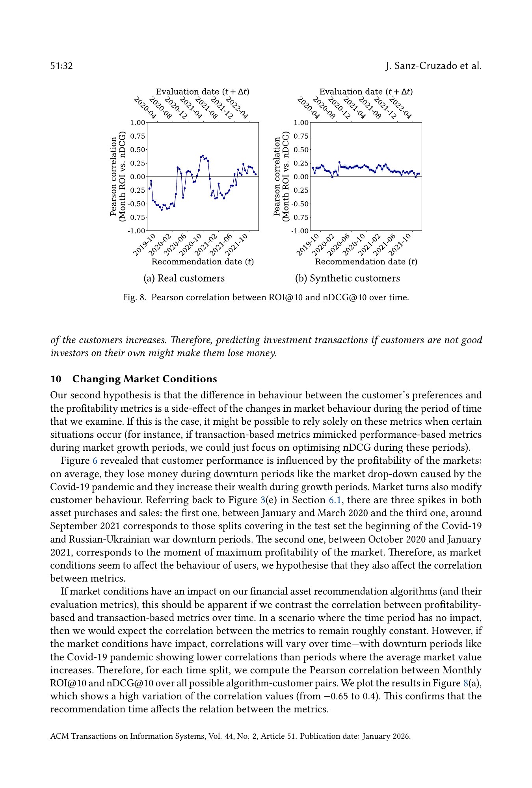

| (a) Real customers | (b) Synthetic customers |
|---|---|

However, are these variations really caused by the upturns and downturns of the market? In order to check this, we explore to what extent three market variables can be used to predict the sign of the correlation: the market returns, the customer returns and the difference between them (customer returns minus market returns). We evaluate these predictors using accuracy (the fraction of time points where the sign of the market variable and the correlation match).

We show the results in Figure 9. From the three studied signals, surprisingly, the profitability of the market can only explain the correlation between metrics in around 50% of the studied time points: thus showing that market behaviour by itself is not an influential factor driving the relation between the metrics. Instead, the most effective signal to determine whether recommending those assets preferred by customers yield more profits to these customers is actually the customer's capacity to beat the market: with an accuracy around 85%.

**Figure 9: Classification accuracy of market signals (6 months).**

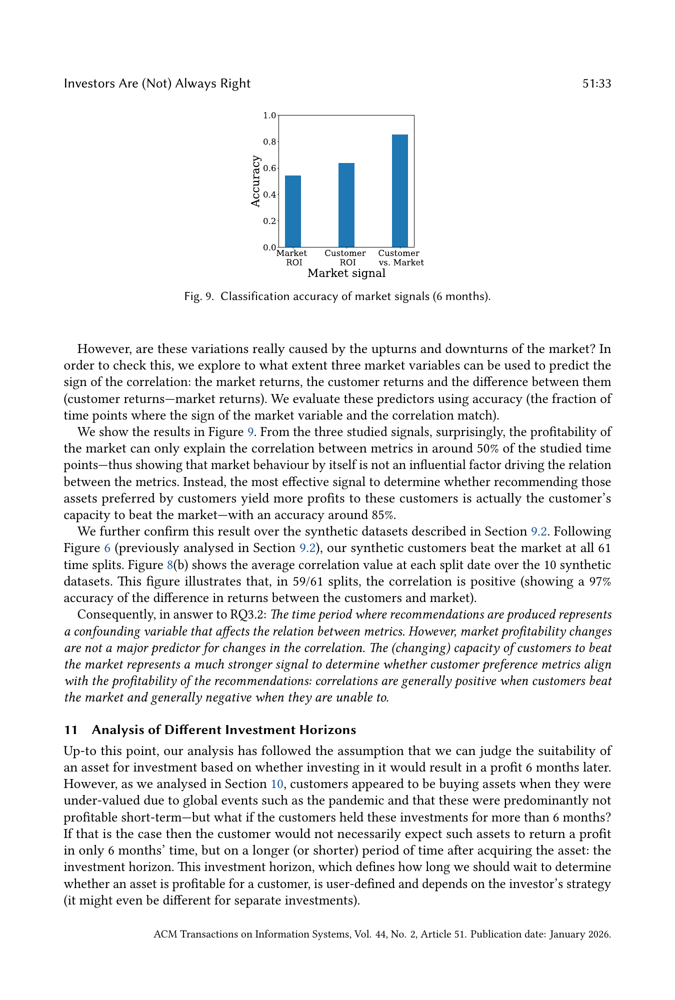

We further confirm this result over the synthetic datasets described in Section 9.2. Following Figure 6 (previously analysed in Section 9.2), our synthetic customers beat the market at all 61 time splits. Figure 8(b) shows the average correlation value at each split date over the 10 synthetic datasets. This figure illustrates that, in 59/61 splits, the correlation is positive (showing a 97% accuracy of the difference in returns between the customers and market).

Consequently, in answer to RQ3.2: *The time period where recommendations are produced represents a confounding variable that affects the relation between metrics. However, market profitability changes are not a major predictor for changes in the correlation. The (changing) capacity of customers to beat the market represents a much stronger signal to determine whether customer preference metrics align with the profitability of the recommendations: correlations are generally positive when customers beat the market and generally negative when they are unable to.*

## 11. Analysis of Different Investment Horizons

Up to this point, our analysis has followed the assumption that we can judge the suitability of an asset for investment based on whether investing in it would result in a profit 6 months later. However, as we analysed in Section 10, customers appeared to be buying assets when they were under-valued due to global events such as the pandemic and that these were predominantly not profitable short-term: but what if the customers held these investments for more than 6 months? If that is the case then the customer would not necessarily expect such assets to return a profit in only 6 months' time, but on a longer (or shorter) period of time after acquiring the asset: the investment horizon. This investment horizon, which defines how long we should wait to determine whether an asset is profitable for a customer, is user-defined and depends on the investor's strategy (it might even be different for separate investments).

### 11.1 Market and Customer Analysis

Due to the volatility of investment markets, a change in the investment horizon is expected to alter the performance of the market and customer portfolios. Since we are working with multiple horizons, we first explore the effect of those changes by analysing the average profitability of customer investments and assets for different time horizons. Figure 11(a) through (e) illustrates the average monthly returns of the market (in blue) and customers (in red) for the 1, 3, 6, 9 and 12 months horizons.

**Figure 10: Classification of customers according to the average time they hold each stock unit.**

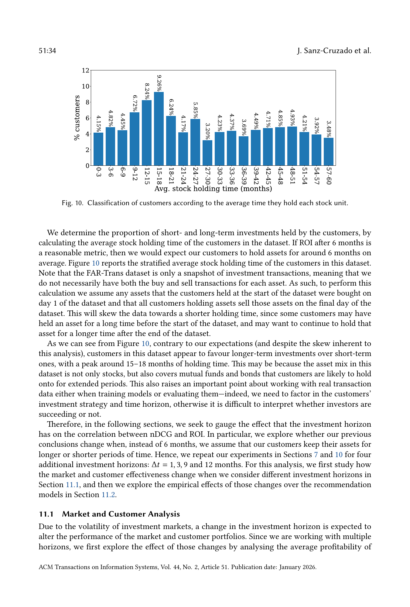

We determine the proportion of short- and long-term investments held by the customers, by calculating the average stock holding time of the customers in the dataset. If ROI after 6 months is a reasonable metric, then we would expect our customers to hold assets for around 6 months on average. Note that the FAR-Trans dataset is only a snapshot of investment transactions, meaning that we do not necessarily have both the buy and sell transactions for each asset. As such, to perform this calculation we assume any assets that customers held at the start of the dataset were bought on day 1 of the dataset and that all customers holding assets sell those assets on the final day of the dataset. This will skew the data towards a shorter holding time, since some customers may have held an asset for a long time before the start of the dataset, and may want to continue to hold that asset for a longer time after the end of the dataset.

As we can see from Figure 10, contrary to our expectations (and despite the skew inherent to this analysis), customers in this dataset appear to favour longer-term investments over short-term ones, with a peak around 15 to 18 months of holding time. This may be because the asset mix in this dataset is not only stocks, but also covers mutual funds and bonds that customers are likely to hold onto for extended periods. This also raises an important point about working with real transaction data either when training models or evaluating them: indeed, we need to factor in the customers' investment strategy and time horizon, otherwise it is difficult to interpret whether investors are succeeding or not.

Therefore, in the following sections, we seek to gauge the effect that the investment horizon has on the correlation between nDCG and ROI. In particular, we explore whether our previous conclusions change when, instead of 6 months, we assume our customers keep their assets for longer or shorter periods of time. Hence, we repeat our experiments in Sections 7 and 10 for four additional investment horizons: dt = 1, 3, 9 and 12 months. For this analysis, we first study how the market and customer effectiveness change when we consider different investment horizons in Section 11.1, and then we explore the empirical effects of those changes over the recommendation models in Section 11.2.

**Figure 11: Profitability of customers and assets for different time horizons.**

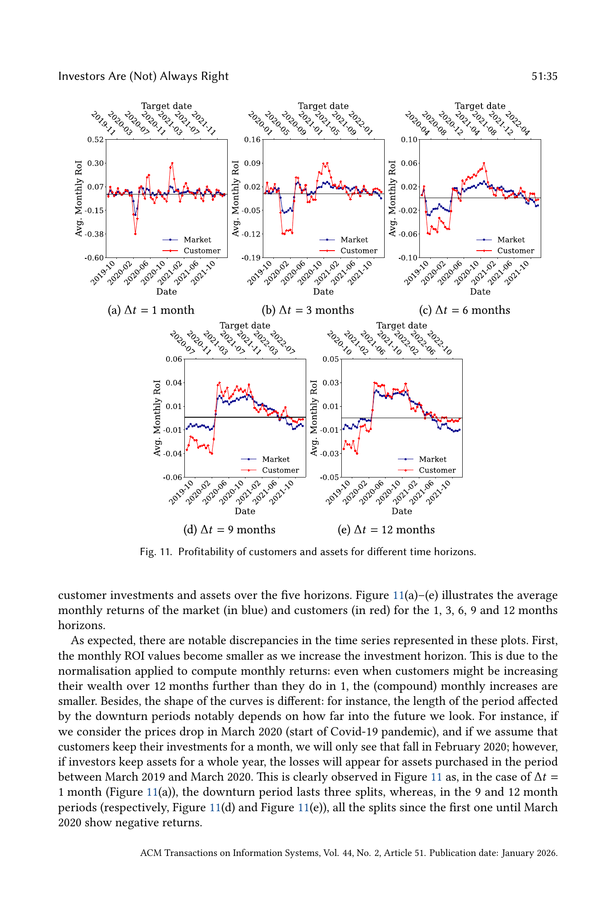

| (a) dt = 1 month | (b) dt = 3 months | (c) dt = 6 months |
|---|---|---|
| (d) dt = 9 months | (e) dt = 12 months | |

As expected, there are notable discrepancies in the time series represented in these plots. First, the monthly ROI values become smaller as we increase the investment horizon. This is due to the normalisation applied to compute monthly returns: even when customers might be increasing their wealth over 12 months further than they do in 1, the (compound) monthly increases are smaller. Besides, the shape of the curves is different: for instance, the length of the period affected by the downturn periods notably depends on how far into the future we look. For instance, if we consider the prices drop in March 2020 (start of Covid-19 pandemic), and if we assume that customers keep their investments for a month, we will only see that fall in February 2020; however, if investors keep assets for a full year, the losses will appear for assets purchased in the period between March 2019 and March 2020. This is clearly observed in Figure 11 as, in the case of dt = 1 month (Figure 11(a)), the downturn period lasts three splits, whereas, in the 9 and 12 month periods (respectively, Figure 11(d) and Figure 11(e)), all the splits until the first one until March 2020 show negative returns.

Finally, we also observe differences in customer behaviour: when we analyse shorter horizons, we observe a greater variance in their performance over time: in the 1 month and 3 month time horizons, we observe both earnings and losses over all the studied time points. However, as we look further into the future, customer behaviour seems more stable and tied to the market performance (where customers earn money during upturns and lose money during downturns).

In conclusion, choosing different investment horizons modifies the profitability of the market and the effectiveness of customers as investors across the different splits. As we shall see later, these differences might lead to changes in the relation between the transaction and profitability-based metrics.

### 11.2 Algorithm Comparison

Considering the changes to the profitability of customers and assets, we aim to study whether the investment horizon is a confounding factor in FAR evaluation, affecting the relation between metrics. Hence, we repeat the experiments in Sections 7 and 10, but vary the investment horizon dt in 1, 3, 9 and 12 months.

#### 11.2.1 Global Correlation

We first compute the Pearson correlation between nDCG@10 and monthly ROI@10 for each time horizon dt using the same procedure as in Section 7: across all (split date, algorithm, customer) triplets. We show the results in Figure 12(a), where the x-axis shows the investment horizon dt (in months) and the y-axis represents the value of the correlation for that investment horizon.

**Figure 12: Pearson correlation at different investment horizons.**

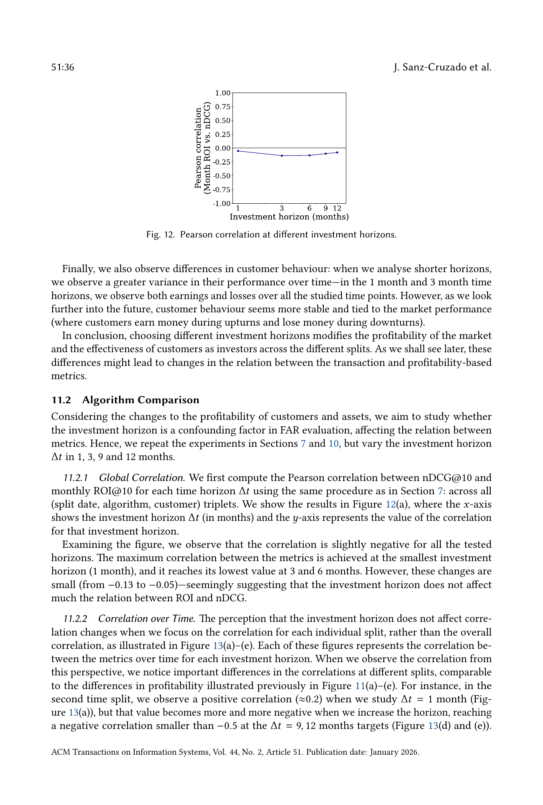

Examining the figure, we observe that the correlation is slightly negative for all the tested horizons. The maximum correlation between the metrics is achieved at the smallest investment horizon (1 month), and it reaches its lowest value at 3 and 6 months. However, these changes are small (from -0.13 to -0.05): seemingly suggesting that the investment horizon does not affect much the relation between ROI and nDCG.

#### 11.2.2 Correlation over Time

The perception that the investment horizon does not affect correlation changes when we focus on the correlation for each individual split, rather than the overall correlation, as illustrated in Figure 13(a) through (e). Each of these figures represents the correlation between the metrics over time for each investment horizon. When we observe the correlation from this perspective, we notice important differences in the correlations at different splits, comparable to the differences in profitability illustrated previously in Figure 11(a) through (e). For instance, in the second time split, we observe a positive correlation (approximately 0.2) when we study dt = 1 month (Figure 13(a)), but that value becomes more and more negative when we increase the horizon, reaching a negative correlation smaller than -0.5 at the dt = 9, 12 months targets (Figure 13(d) and (e)).

**Figure 13: Correlation between monthly ROI@10 and nDCG@10 for different time horizons, divided by date.**

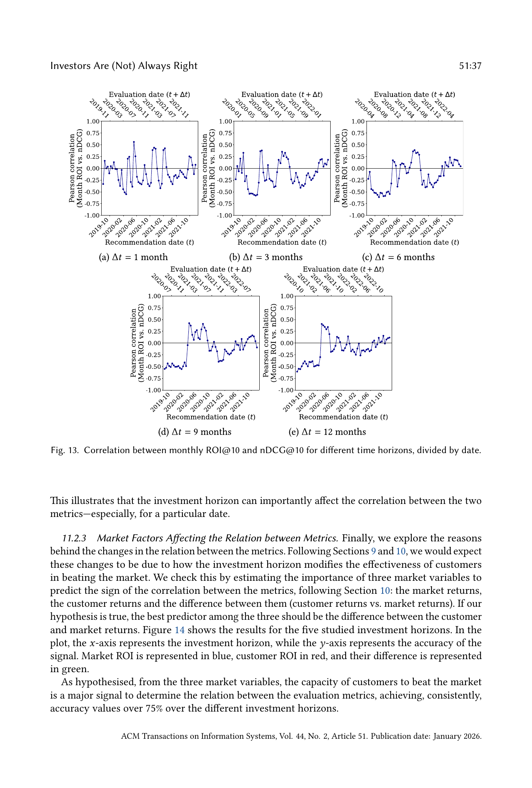

| (a) dt = 1 month | (b) dt = 3 months | (c) dt = 6 months |
|---|---|---|
| (d) dt = 9 months | (e) dt = 12 months | |

This illustrates that the investment horizon can importantly affect the correlation between the two metrics: especially, for a particular date.

#### 11.2.3 Market Factors Affecting the Relation between Metrics

Finally, we explore the reasons behind the changes in the relation between the metrics. Following Sections 9 and 10, we would expect these changes to be due to how the investment horizon modifies the effectiveness of customers in beating the market. We check this by estimating the importance of three market variables to predict the sign of the correlation between the metrics, following Section 10: the market returns, the customer returns and the difference between them (customer returns vs. market returns). If our hypothesis is true, the best predictor among the three should be the difference between the customer and market returns. Figure 14 shows the results for the five studied investment horizons. In the plot, the x-axis represents the investment horizon, while the y-axis represents the accuracy of the signal. Market ROI is represented in blue, customer ROI in red, and their difference is represented in green.

**Figure 14: Classification accuracy of market signals over different time horizons.**

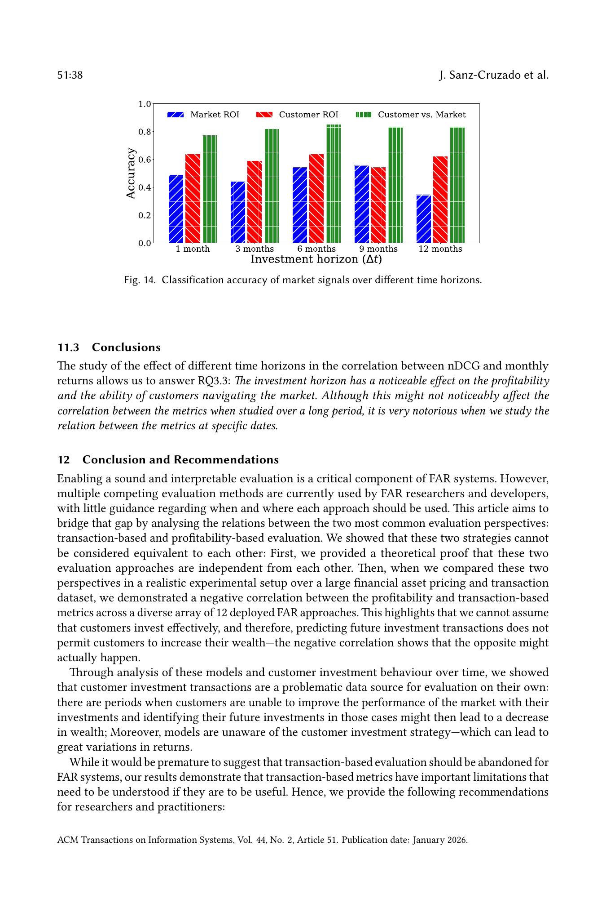

As hypothesised, from the three market variables, the capacity of customers to beat the market is a major signal to determine the relation between the evaluation metrics, achieving consistently accuracy values over 75% over the different investment horizons.

### 11.3 Conclusions

The study of the effect of different time horizons in the correlation between nDCG and monthly returns allows us to answer RQ3.3: *The investment horizon has a noticeable effect on the profitability and the ability of customers navigating the market. Although this might not noticeably affect the correlation between the metrics when studied over a long period, it is very notorious when we study the relation between the metrics at specific dates.*

## 12. Conclusion and Recommendations

Enabling a sound and interpretable evaluation is a critical component of FAR systems. However, multiple competing evaluation methods are currently used by FAR researchers and developers, with little guidance regarding when and where each approach should be used. This article aims to bridge that gap by analysing the relations between the two most common evaluation perspectives: transaction-based and profitability-based evaluation. We showed that these two strategies cannot be considered equivalent to each other: First, we provided a theoretical proof that these two evaluation approaches are independent from each other. Then, when we compared these two perspectives in a realistic experimental setup over a large financial asset pricing and transaction dataset, we demonstrated a negative correlation between the profitability and transaction-based metrics across a diverse array of 12 deployed FAR approaches. This highlights that we cannot assume that customers invest effectively, and therefore predicting future investment transactions does not permit customers to increase their wealth: the negative correlation shows that the opposite might actually happen.

Through analysis of these models and customer investment behaviour over time, we showed that customer investment transactions are a problematic data source for evaluation on their own: there are periods when customers are unable to improve the performance of the market with their investments and identifying their future investments in those cases might then lead to a decrease in wealth; Moreover, models are unaware of the customer investment strategy: which can lead to great variations in returns.

While it would be premature to suggest that transaction-based evaluation should be abandoned for FAR systems, our results demonstrate that transaction-based metrics have important limitations that need to be understood if they are to be useful. Hence, we provide the following recommendations for researchers and practitioners:

- *Complement Transaction-based Evaluation:* Due to the limitations of transaction-based metrics, these metrics should not be used alone to evaluate FAR models. At least, researchers and practitioners should also evaluate the profitability of their proposed approaches.
- *Consider Changing Market Conditions:* Financial markets are in a state of continuous change, something that might be even more noticeable with the emergence of global events like pandemics or wars (which have a huge impact over the market). Major events influence the expectations people have on market segments, prompting customers to change their investment positions. Models trained using transaction-based metrics will perform poorly during such times, as past and current investment behaviour are no longer similar. In addition, sudden market changes might confound profitability prediction algorithms and affect their performance. Hence, it is important to report performance over time to reveal when these changes occur, and solution developers might wish to consider fall-back strategies during such times.
- *Investment Horizons are a Confounding Variable:* Different customers plan for different investment time horizons (how long they want to hold an asset for). Analysis of our dataset indicated that these time horizons are markedly longer than we anticipated, with the peak between 15 and 18 months, but with a wide range of horizons being observed. This has several important consequences for evaluation. First, individual customer transactions become difficult to interpret, as we cannot know in advance the customer's envisaged investment horizon. Second, aggregate metrics like nDCG conflate customers with different horizons, hence models trained based on such metrics will likely perform poorly in practice (since we do not know how long to hold a recommended asset for).
- *Know Your Customers:* Identifying the strengths and weaknesses of customers as investors is fundamental for the identification and development of effective financial asset recommendation algorithms. For instance, if customers commonly perform under the market, exploiting their past transactions as input of collaborative filtering algorithms might further increase the gap between user and market performance. A thorough analysis of the skills and expertise of the users is needed to find profitable algorithms.

As future work, we envisage the creation of an adequate and robust framework for FAR evaluation, which puts the focus on the customers and their trading strategies. To develop such a framework, it is necessary to understand what role customer features (such as the effects patterns of spending, relationship with the financial institutions, risk aversion, trading platform or sector interest) might have on FAR evaluation. Another line of research might address how the past actions of financial institutions might affect the evaluation, as past actions of financial advisors might introduce some biases on the collected datasets (similarly to how the actions of past recommendation policies introduce selection biases on offline datasets for general domain recommendation [Schnabel2016]).

## Limitations

We discuss here the limitations of the theoretical and empirical analysis carried in this work. We focus this discussion on three aspects: the fixed investment horizon, the CI property of transaction-based metrics and the limitations of the dataset.

*Investment Horizon.* In our theoretical formulations and experiments, we commonly consider a fixed investment horizon shared by all customers. As seen in Figure 10, this is a simplification, as people might consider different holding times for their investments. We have applied this simplification as it is common practice in the evaluation of financial asset recommendations [Alzaman2024, Lee2024, SanzCruzado2024, Zheng2020].

In our experiments, we consider only short-to-mid-term investment horizons, ranging from 1 month to a year. While Figure 10 suggests that customers in our data hold their investment for even longer times (79.86% of the customers hold their investments for more than 1 year), the time span of our dataset does not allow us to test longer horizons: for a fixed investment horizon, dt, we would need sufficient data after the last split date of our dataset. For instance, for dt = 2 years, we would need at least 2 years of data after the last split date of our dataset, November 2021, but our dataset only has data until November 2022. Therefore, the maximum value of dt we can test with this dataset is 1 year. Furthermore, it is not possible to move the splits to earlier dates, since we also need a sufficiently long training period to train the different models: for instance, for the profitability-based models, we need, at least, dt + 6 months of training data before the first split date. In our experimental setup, we have 18 months of data before the first split, corresponding to the minimum period needed for dt = 1 year.

While customers might take more time to sell their assets, we argue that these shorter horizons still represent a realistic scenario: while investors might hold their investment for longer, financial institutions recommend investors to check and rebalance their investment horizons at least once a year [Zhang2022]. This periodical check aligns with our investment horizons choices. In addition to this, the experiments in Section 11 seem to indicate that our findings should generalise when looking at longer investment horizons.

*CI.* The profitability-based metrics that we have defined in this work follow the CI property. This property indicates that the profitability of a recommendation does only depend on the recommended assets, and not in the customer. We have considered this property as it represents a common simplification applied in past financial asset recommendation research. However, this simplification might not always hold in realistic investment scenarios for two reasons:

(1) *Portfolio weights:* By considering profitability-based metrics independent of the customer, we are assuming that a customer invests the same amount of money on every asset. However, this is rarely true in practice. Customers build their investment portfolios by allocating different amounts of money according to factors like their risk awareness (for example, a very risk-averse investor should allocate more money to safer assets like government bonds than to stocks).
(2) *Customer goals:* Different customers might also react differently to the same level of profitability, depending on factors like their initial investment or their goals. For instance, it is easier to achieve enough money to buy a videogame console with low returns than it is to buy a house.

Any metric considering these two factors would fall into the hybrid metric category, and are, therefore, out of the scope of this work. Hybrid metrics capable of considering aspects like portfolio weights or customer goals require additional customer information that is not easily accessible: for instance, if we wanted to consider portfolio weights, we would need to estimate how much money a customer might invest on each asset: even on assets on which the customer has never invested before. We envision exploring these hybrid metrics as future work.

Another alternative to evaluate customers according to their goals/portfolio allocation might rely on expert ratings to evaluate the models. However, this evaluation is unfeasible on a large dataset like the one explored in this work: we would need expert scores for 29,090 customers at 61 points in time for 12 algorithms. The cost would be even bigger if we consider the experiment with synthetic users and the different time horizons.

*Dataset Limitations.* Our analysis is limited to a single investment dataset, FAR-Trans [SanzCruzado2024]. As far as we are aware, FAR-Trans is currently the only public large-scale investment dataset containing both asset information and customer investment transactions. This dataset has limitations. First, it only provides a partial view of the investors' portfolios, representing investments in publicly-traded financial assets that might pose a risk to the investor. Banking institutions commonly have privately created risk-less assets that can complement the riskier stocks or funds and are not available in the data. And second, it does only provide pricing information about the assets, ignoring other factors that might influence their profitability, such as stock dividend or bond coupon payments.

However, it still represents a real-world dataset, representing the day-to-day operation of investments in a large financial institution. While the global correlations between transaction-based and profitability-based metrics might change if we analyse the same data for a different institution, we expect our main conclusion to remain the same: investment transactions represent a problematic source of data for evaluating financial asset recommendations, as they do not reflect whether customers earn money with them.

## Data Statement

The dataset used for supporting the experiments in this article is available at https://doi.org/10.5525/gla.researchdata.1658. The demographic information about the users could not be shared due to its sensitive nature.

## Acknowledgments

The work introduced in this article was in part carried out within the Infinitech project which has been supported by the European Union's Horizon 2020 Research and Innovation programme under grant agreement no. 856632. Subsequent development was also financially supported via Engineering and Physical Sciences Research Council (EPSRC) Impact Acceleration Account, part of UK Research and Innovation (UKRI) with grant ref. number EP/X525716/1.

## References

- **[Agrawal1994]** Rakesh Agrawal and Ramakrishnan Srikant. "Fast Algorithms for Mining Association Rules in Large Databases." In *Proceedings of the 20th International Conference on Very Large Data Bases (VLDB '94)*. Morgan Kaufmann Publishers Inc., 487-499, 1994.
- **[Alsulmi2022]** Mohammad Alsulmi. "From Ranking Search Results to Managing Investment Portfolios: Exploring Rank-Based Approaches for Portfolio Stock Selection." *Electronics* 11, 23, Article 4019 (2022), 1-22. DOI: https://doi.org/10.3390/electronics11234019
- **[Alzaman2024]** Chaher Alzaman. "Deep Learning in Stock Portfolio Selection and Predictions." *Expert Systems with Applications* 237, Article 121404 (2024), 1-11. DOI: https://doi.org/10.1016/j.eswa.2023.121404
- **[Barreau2020]** Baptiste Barreau and Laurent Carlier. "History-Augmented Collaborative Filtering for Financial Recommendations." In *Proceedings of the 14th ACM Conference on Recommender Systems (RecSys '20)*, Virtual Event. ACM, 492-497. DOI: https://doi.org/10.1145/3383313.3412206
- **[Bogaert2019]** Matthias Bogaert, Justine Lootens, Dirk Van den Poel, and Michel Ballings. "Evaluating Multi-Label Classifiers and Recommender Systems in the Financial Service Sector." *European Journal of Operational Research* 279, 2 (2019), 620-634. DOI: https://doi.org/10.1016/j.ejor.2019.05.037
- **[Burke2007]** Robin D. Burke. "Hybrid Web Recommender Systems." In *The Adaptive Web: Methods and Strategies of Web Personalization*. Peter Brusilovsky, Alfred Kobsa, and Wolfgang Nejdl (Eds.), Springer, Berlin, 377-408. DOI: https://doi.org/10.1007/978-3-540-72079-9_12
- **[Burges2010]** Chris Burges. "From RankNet to LambdaRank to LambdaMART: An Overview." Microsoft Research Technical Report MSR-TR-2010-82. Microsoft.
- **[Cañamares2017]** Rocio Cañamares and Pablo Castells. "A Probabilistic Reformulation of Memory-Based Collaborative Filtering: Implications on Popularity Biases." In *Proceedings of the 40th International ACM SIGIR Conference on Research and Development in Information Retrieval (SIGIR '17)*. ACM, 215-224. DOI: https://doi.org/10.1145/3077136.3080836
- **[Cañamares2018]** Rocio Cañamares and Pablo Castells. "Should I Follow the Crowd? A Probabilistic Analysis of the Effectiveness of Popularity in Recommender Systems." In *Proceedings of the 41st International ACM SIGIR Conference on Research and Development in Information Retrieval (SIGIR '18)*. ACM, 415-424. DOI: https://doi.org/10.1145/3209978.3210014
- **[Cañamares2020]** Rocio Cañamares, Pablo Castells, and Alistair Moffat. "Offline Evaluation Options for Recommender Systems." *Information Retrieval Journal* 23, 4 (2020), 387-410. DOI: https://doi.org/10.1007/s10791-020-09371-3
- **[Chalidabhongse2006]** Thanarat H. Chalidabhongse and Chayaporn Kaensar. "A Personalized Stock Recommendation System using Adaptive User Modeling." In *Proceedings of the 2006 International Symposium on Communications and Information Technologies (ISCIT '06)*. IEEE, 463-468. DOI: https://doi.org/10.1109/ISCIT.2006.339989
- **[Cremonesi2010]** Paolo Cremonesi, Yehuda Koren, and Roberto Turrin. "Performance of Recommender Algorithms on Top-N Recommendation Tasks." In *Proceedings of the 4th ACM Conference on Recommender Systems (RecSys '10)*. ACM, 39-46. DOI: https://doi.org/10.1145/1864708.1864721
- **[Feng2019]** Fuli Feng, Xiangnan He, Xiang Wang, Cheng Luo, Yiqun Liu, and Tat-Seng Chua. "Temporal Relational Ranking for Stock Prediction." *ACM Transactions on Information Systems* 37, 2, Article 27 (2019), 1-30. DOI: https://doi.org/10.1145/3309547
- **[Feng2022]** Shibo Feng, Chen Xu, Yu Zuo, Guo Chen, Fan Lin, and Jianbing XiaHou. "Relation-Aware Dynamic Attributed Graph Attention Network for Stocks Recommendation." *Pattern Recognition* 121, Article 108119 (2022), 1-12. DOI: https://doi.org/10.1016/j.patcog.2021.108119
- **[Ghiye2023]** Ashraf Ghiye, Baptiste Barreau, Laurent Carlier, and Michalis Vazirgiannis. "Adaptive Collaborative Filtering with Personalized Time Decay Functions for Financial Product Recommendation." In *Proceedings of the 17th ACM Conference on Recommender Systems (RecSys '23)*. ACM, 798-804. DOI: https://doi.org/10.1145/3604915.3608832
- **[Gonzales2022]** Reyes Michaela Denise Gonzales and Carol Anne Hargreaves. "How Can We Use Artificial Intelligence for Stock Recommendation and Risk Management? A Proposed Decision Support System." *International Journal of Information Management Data Insights* 2, 2, Article 100130 (2022), 1-10. DOI: https://doi.org/10.1016/j.jjimei.2022.100130
- **[Gonzalez2012]** Israel Gonzalez-Carrasco, Ricardo Colomo-Palacios, Jose Luis Lopez-Cuadrado, Angel Garcia-Crespo, and Belen Ruiz-Mezcua. "PB-ADVISOR: A Private Banking Multi-Investment Portfolio Advisor." *Information Sciences* 206 (2012), 63-82. DOI: https://doi.org/10.1016/j.ins.2012.04.008
- **[Gunawardana2022]** Asela Gunawardana, Guy Shani, and Sivan Yogev. "Evaluating Recommender Systems." In *Recommender Systems Handbook* (3rd ed.). Francesco Ricci, Lior Rokach, and Bracha Shapira (Eds.), Springer, New York, NY, 547-601. DOI: https://doi.org/10.1007/978-1-0716-2197-4_15
- **[Guolin2017]** Guolin Ke, Qi Meng, Thomas Finley, Taifeng Wang, Wei Chen, Weidong Ma, Qiwei Ye, and Tie-Yan Liu. "LightGBM: A Highly Efficient Gradient Boosting Decision Tree." In *Proceedings of the 30th Conference on Neural Information Processing Systems (NeurIPS '17)*. Curran Associates, Inc.
- **[He2017]** Xiangnan He, Lizi Liao, Hanwang Zhang, Liqiang Nie, Xia Hu, and Tat-Seng Chua. "Neural Collaborative Filtering." In *Proceedings of the 26th International Conference on World Wide Web (WWW '17)*. International World Wide Web Conferences Steering Committee, 173-182. DOI: https://doi.org/10.1145/3038912.3052569
- **[He2020]** Xiangnan He, Kuan Deng, Xiang Wang, Yan Li, YongDong Zhang, and Meng Wang. "LightGCN: Simplifying and Powering Graph Convolution Network for Recommendation." In *Proceedings of the 43rd International ACM SIGIR Conference on Research and Development in Information Retrieval (SIGIR '20)*, Virtual Event. ACM, 639-648. DOI: https://doi.org/10.1145/3397271.3401063
- **[Hsu2022]** Yi-Ling Hsu, Yu-Che Tsai, and Cheng-Te Li. "FinGAT: Financial Graph Attention Networks for Recommending Top-K Profitable Stocks." *IEEE Transactions on Knowledge and Data Engineering* 35, 1 (2023), 469-481. DOI: https://doi.org/10.1109/TKDE.2021.3079496
- **[Jannach2023]** Dietmar Jannach and Himan Abdollahpouri. "A Survey on Multi-Objective Recommender Systems." *Frontiers in Big Data* 6, Article 1157899 (2023), 1-12. DOI: https://doi.org/10.3389/fdata.2023.1157899
- **[Jarvelin2002]** Kalervo Jarvelin and Jaana Kekalainen. "Cumulated Gain-Based Evaluation of IR Techniques." *ACM Transactions on Information Systems* 20, 4 (Oct. 2002), 422-446. DOI: https://doi.org/10.1145/582415.582418
- **[Kibble2020]** Richard Kibble, Margaret Doyle, and Alexandra Dobra-Kiel. *The Future of Retail Banking: The Hyper-Personalization Imperative.* Technical Report. Deloitte, 2020.
- **[Kubota2022]** Kohsuke Kubota, Hiroyuki Sato, Wataru Yamada, Keiichi Ochiai, and Hiroshi Kawakami. "Content-Based Stock Recommendation Using Smartphone Data." *Journal of Information Processing* 30 (2022), 361-371. DOI: https://doi.org/10.2197/ipsjjip.30.361
- **[Lee2014]** Eric L. Lee, Jing-Kai Lou, Wei-Ming Chen, Yen-Chi Chen, Shou-De Lin, Yen-Sheng Chiang, and Kuan-Ta Chen. "Fairness-Aware Loan Recommendation for Microfinance Services." In *Proceedings of the 2014 International Conference on Social Computing (SocialCom '14)*. ACM, 1-4. DOI: https://doi.org/10.1145/2639968.2640064
- **[Lee2024]** Youngbin Lee, Yejin Kim, Javier Sanz-Cruzado, Richard McCreadie, and Yongjae Lee. "Stock Recommendations for Individual Investors: A Temporal Graph Network Approach with Mean-Variance Efficient Sampling." In *Proceedings of the 5th ACM International Conference on AI in Finance (ICAIF '24)*. ACM, 795-803. DOI: https://doi.org/10.1145/3677052.3698662
- **[Liu2009]** Tie-Yan Liu. "Learning to Rank for Information Retrieval." *Foundations and Trends in Information Retrieval* 3, 3 (2009), 225-331. DOI: https://doi.org/10.1561/1500000016
- **[Luef2020]** Johannes Luef, Christian Ohrfandl, Dimitris Sacharidis, and Hannes Werthner. "A Recommender System for Investing in Early-Stage Enterprises." In *Proceedings of the 35th Annual ACM Symposium on Applied Computing (SAC '20)*. ACM, 1453-1460. DOI: https://doi.org/10.1145/3341105.3375767
- **[Markowitz1952]** Harry Markowitz. "Portfolio Selection." *The Journal of Finance* 7, 1 (1952), 77-91. DOI: https://doi.org/10.1111/j.1540-6261.1952.tb01525.x
- **[Marlin2007]** Benjamin M. Marlin, Richard S. Zemel, Sam Roweis, and Malcolm Slaney. "Collaborative Filtering and the Missing at Random Assumption." In *Proceedings of the 23rd Conference on Uncertainty in Artificial Intelligence (UAI '07)*. AUAI Press, 267-275.
- **[Matsatsinis2009]** Nikolaos F. Matsatsinis and Eleftherios A. Manarolis. "New Hybrid Recommender Approaches: An Application to Equity Funds Selection." In *Proceedings of the 1st International Conference on Algorithmic Decision Theory (ADT '09)*. Springer, Berlin, 156-167. DOI: https://doi.org/10.1007/978-3-642-04428-1_14
- **[McCreadie2022]** Richard McCreadie, Konstantinos Perakis, Maanasa Srikrishna, Nikolaos Droukas, Stamatis Pitsios, Georgia Prokopaki, Eleni Perdikouri, Craig Macdonald, and Iadh Ounis. "Next-Generation Personalized Investment Recommendations." Springer International Publishing, Cham, 171-198. DOI: https://doi.org/10.1007/978-3-030-94590-9_10
- **[Moffat2013]** Alistair Moffat. "Seven Numeric Properties of Effectiveness Metrics." In *Proceedings of the 9th Asia Information Retrieval Societies Conference (AIRS '13)*. Lecture Notes in Computer Science, Vol. 8281, Springer, Singapore, 1-12. DOI: https://doi.org/10.1007/978-3-642-45068-6_1
- **[Murphy1999]** John J. Murphy. *Technical Analysis of the Financial Markets: A Comprehensive Guide to Trading Methods and Applications.* Penguin Publishing Group, London, 1999.
- **[Musto2015]** Cataldo Musto and Giovanni Semeraro. "Case-Based Recommender Systems for Personalized Finance Advisory." In *Proceedings of the 1st International Workshop on Personalization and Recommender Systems in Financial Services (FinRec '15)*. CEUR Workshop Proceedings, 35-36.
- **[Musto2014]** Cataldo Musto, Giovanni Semeraro, Pasquale Lops, Marco de Gemmis, and Georgios Lekkas. "Financial Product Recommendation through Case-Based Reasoning and Diversification Techniques." In *Poster Proceedings of the 8th ACM Conference on Recommender Systems (RecSys '14)*. CEUR Workshop Proceedings, 2014.
- **[Musto2015b]** Cataldo Musto, Giovanni Semeraro, Pasquale Lops, Marco de Gemmis, and Georgios Lekkas. "Personalized Finance Advisory through Case-Based Recommender Systems and Diversification Strategies." *Decision Support Systems* 77 (2015), 100-111. DOI: https://doi.org/10.1016/j.dss.2015.06.001
- **[Nikolakopoulos2022]** Athanasios N. Nikolakopoulos, Xia Ning, Christian Desrosiers, and George Karypis. "Trust Your Neighbors: A Comprehensive Survey of Neighborhood-Based Methods for Recommender Systems." In *Recommender Systems Handbook* (3rd ed.). Francesco Ricci, Lior Rokach, and Bracha Shapira (Eds.), Springer, New York, NY, 39-89. DOI: https://doi.org/10.1007/978-1-0716-2197-4_2
- **[Paranjape2013]** Preeti Paranjape-Voditel and Umesh Deshpande. "A Stock Market Portfolio Recommender System Based on Association Rule Mining." *Applied Soft Computing* 13, 2 (2013), 1055-1063. DOI: https://doi.org/10.1016/j.asoc.2012.09.012
- **[Qin2024]** Chuan Qin, Jun Chang, Wenting Tu, and Changrui Yu. "FollowAKOInvestor: Stock Recommendation by Hearing Voices from All Kinds of Investors with Machine Learning." *Expert Systems with Applications* 249, Article 123522 (2024), 1-14. DOI: https://doi.org/10.1016/j.eswa.2024.123522
- **[Quah1999]** Tong-Seng Quah and Bobby Srinivasan. "Improving Returns on Stock Investment through Neural Network Selection." *Expert Systems with Applications* 17, 4 (1999), 295-301. DOI: https://doi.org/10.1016/S0957-4174(99)00041-X
- **[Rendle2020]** Steffen Rendle, Walid Krichene, Li Zhang, and John Anderson. "Neural Collaborative Filtering vs. Matrix Factorization Revisited." In *Proceedings of the 14th ACM Conference on Recommender Systems (RecSys '20)*, Virtual Event. ACM, 240-248. DOI: https://doi.org/10.1145/3383313.3412488
- **[Ricci2022]** Francesco Ricci, Lior Rokach, and Bracha Shapira. "Recommender Systems: Techniques, Applications, and Challenges." In *Recommender Systems Handbook*. Francesco Ricci, Lior Rokach, and Bracha Shapira (Eds.), Springer, New York, NY, 1-35. DOI: https://doi.org/10.1007/978-1-0716-2197-4_1
- **[SanzCruzado2022]** Javier Sanz-Cruzado, Richard McCreadie, Nikolaos Droukas, Craig Macdonald, and Iadh Ounis. "On Transaction-Based Metrics as Proxy for Profitability of Financial Asset Recommendations." In *Proceedings of the 3rd International Workshop on Personalization and Recommender Systems in Financial Services (FinRec '22), Co-Located with the 16th ACM Conference on Recommender Systems (RecSys '22)*, 2022.
- **[SanzCruzado2024]** Javier Sanz-Cruzado, Nikolaos Droukas, and Richard McCreadie. "FAR-Trans: An Investment Dataset for Financial Asset Recommendation." In *Proceedings of the IJCAI-2024 Workshop on Recommender Systems in Finance (Fin-RecSys '24), Co-Located with the 33rd International Joint Conference on Artificial Intelligence (IJCAI '24)*, 2024.
- **[Schedl2022]** Markus Schedl, Peter Knees, Brian McFee, and Dmitry Bogdanov. "Music Recommendation Systems: Techniques, Use Cases, and Challenges." In *Recommender Systems Handbook* (3rd ed.). Francesco Ricci, Lior Rokach, and Bracha Shapira (Eds.), Springer, New York, NY, 927-971. DOI: https://doi.org/10.1007/978-1-0716-2197-4_24
- **[Schnabel2016]** Tobias Schnabel, Adith Swaminathan, Ashudeep Singh, Navin Chandak, and Thorsten Joachims. "Recommendations as Treatments: Debiasing Learning and Evaluation." In *Proceedings of the 33rd International Conference on Machine Learning (ICML '16)*. JMLR, 1670-1679, 2016.
- **[Soldatos2022]** John Soldatos and Dimosthenis Kyriazis (Eds.). *Big Data and Artificial Intelligence in Digital Finance.* Springer International Publishing, Cham. DOI: https://doi.org/10.1007/978-3-030-94590-9
- **[Song2017]** Qiang Song, Anqi Liu, and Steve Y. Yang. "Stock Portfolio Selection Using Learning-to-Rank Algorithms with News Sentiment." *Neurocomputing* 264 (2017), 20-28. DOI: https://doi.org/10.1016/j.neucom.2017.02.097
- **[Steck2011]** Harald Steck. "Item Popularity and Recommendation Accuracy." In *Proceedings of the 5th ACM Conference on Recommender Systems (RecSys '11)*. ACM, 125-132. DOI: https://doi.org/10.1145/2043932.2043957
- **[Steffen2009]** Steffen Freudentaler, Zeno Gantner, and Lars Schmidt-Thieme. "BPR: Bayesian Personalized Ranking from Implicit Feedback." In *Proceedings of the 25th Conference on Uncertainty in Artificial Intelligence (UAI '09)*. AUAI Press, 452-461.
- **[Sun2018]** Yunchuan Sun, Mengting Fang, and Xinyu Wang. "A Novel Stock Recommendation System Using Guba Sentiment Analysis." *Personalized Ubiquitous Computing* 22, 3 (2018), 575-587. DOI: https://doi.org/10.1007/s00779-018-1121-x
- **[Swezey2018]** Robin M. E. Swezey and Bruno Charron. "Large-Scale Recommendation for Portfolio Optimization." In *Proceedings of the 12th ACM Conference on Recommender Systems (RecSys '18)*. ACM, 382-386. DOI: https://doi.org/10.1145/3240323.3240386
- **[Takayanagi2023]** Takehiro Takayanagi, Kiyoshi Izumi, Atsuo Kato, Naoyuki Tsunedomi, and Yukina Abe. "Personalized Stock Recommendation with Investors' Attention and Contextual Information." In *Proceedings of the 46th International ACM SIGIR Conference on Research and Development in Information Retrieval (SIGIR '23)*. ACM, 3339-3343. DOI: https://doi.org/10.1145/3539618.3591850
- **[Takayanagi2023b]** Takehiro Takayanagi, Chung-Chi Chen, and Kiyoshi Izumi. "Personalized Dynamic Recommender System for Investors." In *Proceedings of the 46th International ACM SIGIR Conference on Research and Development in Information Retrieval (SIGIR '23)*. ACM, 2246-2250. DOI: https://doi.org/10.1145/3539618.3592035
- **[Takayanagi2024b]** Takehiro Takayanagi and Kiyoshi Izumi. "Incorporating Domain-Specific Traits into Personality-Aware Recommendations for Financial Applications." *New Generation Computing* 42, 4 (2024), 635-649. DOI: https://doi.org/10.1007/s00354-024-00241-w
- **[Tang2013]** Jiliang Tang, Xia Hu, and Huan Liu. "Social Recommendation: A Review." *Social Network Analysis and Mining* 3, 4 (2013), 1113. DOI: https://doi.org/10.1007/s13278-013-0141-9
- **[Tu2018]** Wenting Tu, Min Yang, David W. Cheung, and Nikos Mamoulis. "Investment Recommendation by Discovering High-Quality Opinions in Investor Based Social Networks." *Information Systems* 78 (2018), 189-198. DOI: https://doi.org/10.1016/j.is.2018.02.011
- **[Welch2022]** Ivo Welch. "The Wisdom of the Robinhood Crowd." *The Journal of Finance* 77, 3 (2022), 1489-1527. DOI: https://doi.org/10.1111/jofi.13128
- **[Wu2024]** Mei-Chen Wu, Szu-Hao Huang, and An-Pin Chen. "Momentum Portfolio Selection Based on Learning-to-Rank Algorithms with Heterogeneous Knowledge Graphs." *Applied Intelligence* 54, 5 (2024), 4189-4209. DOI: https://doi.org/10.1007/S10489-024-05377-2
- **[Yang2018]** Hongyang Yang, Xiao-Yang Liu, and Qingwei Wu. "A Practical Machine Learning Approach for Dynamic Stock Recommendation." In *Proceedings of the 17th IEEE International Conference on Trust, Security and Privacy in Computing and Communications / 12th IEEE International Conference on Big Data Science and Engineering (TrustCom/BigDataSE '18)*. IEEE, New York, NY, 1693-1697. DOI: https://doi.org/10.1109/TrustCom/BigDataSE.2018.00253
- **[Yujun2016]** Yang Yujun, Li Jianping, and Yang Yimei. "An Efficient Stock Recommendation Model Based on Big Order Net Inflow." *Mathematical Problems in Engineering* 2016, Article 5725143 (2016), 15 pages. DOI: https://doi.org/10.1155/2016/5725143
- **[Zangerle2023]** Eva Zangerle and Christine Bauer. "Evaluating Recommender Systems: Survey and Framework." *ACM Computing Surveys* 55, 8, Article 170 (2023), 1-38. DOI: https://doi.org/10.1145/3556536
- **[Zhang2022]** Yu Zhang, Harshdeep Ahluwalia, Allison Ying, Michael Rabinovich, and Aidan Geysen. *Rational Rebalancing: An Analytical Approach to Multiasset Portfolio Rebalancing Decisions and Insights.* Technical Report. Vanguard, 2022.
- **[Zhao2015]** Xiaoxue Zhao, Weinan Zhang, and Jun Wang. "Risk-Hedged Venture Capital Investment Recommendation." In *Proceedings of the 9th ACM Conference on Recommender Systems (RecSys '15)*. ACM, 75-82. DOI: https://doi.org/10.1145/2792838.2800181
- **[Zheng2020]** Zeqi Zheng, Yuandong Gao, Likang Yin, and Monika K. Rabarison. "Modeling and Analysis of a Stock-Based Collaborative Filtering Algorithm for the Chinese Stock Market." *Expert Systems with Applications* 162 (2020), 113006. DOI: https://doi.org/10.1016/j.eswa.2019.113006
- **[Zibriczky2016]** David Zibriczky. "Recommender Systems Meet Finance: A Literature Review." In *Proceedings of the 2nd International Workshop on Personalization and Recommender Systems in Financial Services (FinRec '16)*. CEUR Workshop Proceedings, 3-10.

## Appendices

## A. Complete Proofs

This appendix includes the complete and thorough formal proofs for the lemmas and theorems stated in Section 5.

### A.1 Theorem 5.4

We aim to prove Theorem 5.4. In order to do this, we first need to prove the following lemma:

**Lemma A.1.** Let m be a transaction metric. Given t, dt and a customer u in U, it is possible to build a customer v with I_v(t) = empty set such that, for all R subset of I \ I_u(t), |R| = k, m@k(u, R, t, dt) = m@k(v, R, t, dt).

**Proof.** We can prove this lemma by induction on the number of assets in I_u(t).

- *Case |I_u(t)| = 1:* For any valid R, R subset of I \ I_u(t). If we remove the only asset from I_u(t), we create a new customer v, with I_v(t) = empty set. R subset of I \ I_u(t) subset of I = I \ I_v(t). Therefore, by the CE property, m@k(u, R, t, dt) = m@k(v, R, t, dt).
- *Case |I_u(t)| = k + 1:* Let's suppose that the previous lemma is true for |I_u(t)| = k > 1. Now, we want to prove it for |I_u(t)| = k + 1. Without loss of generality, we can pick any asset i from I_u(t) and remove it. This creates a new customer w with I_w = I_u \ {i}. By the induction principle, as |I_w(t)| = k, we can find a customer v such that I_v(t) = empty set and, for every ranking R subset of I subset of I_v(t), m@k(v, R, t, dt) = m@k(w, R, t, dt). As I \ I_u subset of I \ (I_u \ {i}) = I \ I_w, for all valid recommendation rankings for u, that equality is true for all the possible rankings for u, m@k(u, R, t, dt) = m@k(w, R, t, dt) = m@k(v, R, t, dt).

Now, we can continue by proving Theorem 5.4. The formulation of the theorem is the following.

**Theorem A.2.** Given r >= 0, a transaction-based metric m, I a set of assets and a test period (t, dt). Let u, v in U two customers and R_u = [i_1^u, ..., i_k^u] subset of I \ I_u(t), R_v = [i_1^v, ..., i_k^v] subset of I \ I_v(t) two recommendation rankings such that:

(1) For all l, i_l^u in rel_u(t, dt) iff i_l^v in rel_v(t, dt);
(2) |rel_u(t, dt)| = |rel_v(t, dt)|.

Then, m@k(u, R_u, t, dt) = m@k(v, R_v, t, dt).

**Proof.** By Lemma A.1, given u, v, we can find two equivalent customers, u', v' with I_{u'}(t) = I_{v'}(t) = empty set such that m@k(u, R_u, t, dt) = m@k(u', R_u, t, dt) and m@k(v, R_v, t, dt) = m@k(v', R_v, t, dt). It is therefore enough to proof the theorem for the particular case where I_u(t) = I_v(t) = empty set. For proving the theorem, we just need to gradually transform u and R_u into v and R_v without modifying the value of the metrics. For this, we shall consider properties AII1 and AII2 as follows:

*Step 1:* For every asset i in rel_u(t, dt) \ rel_v(t, dt), we choose j in rel_v(t, dt) \ rel_u(t, dt). Then, we replace j by i in rel_u(t, dt) and:

(1) If i, j in R_u, we swap them.
(2) If i in R_u, j not in R_u we replace i by j in R_u.
(3) If i not in R_u, j in R_u we replace j by i in R_u.

We need to check that these transformations are possible and do not affect the value of the metric.

First, we need to observe that, for every asset i in rel_u(t, dt) \ rel_v(t, dt), another asset j in rel_v(t, dt) \ rel_u(t, dt) exists. As |rel_u(t, dt)| = |rel_v(t, dt)|, by symmetry, it is true that |rel_u(t, dt) \ rel_v(t, dt)| = |rel_v(t, dt) \ rel_u(t, dt)|.

Next, we need to prove that the newly created customer/ranking pair w, R_w at the end of this step can substitute u in terms of the theorem conditions. For this, we should first notice that, after processing every asset i in rel_u(t, dt) \ rel_v(t, dt), we get a new customer w where rel_w = rel_u(t, dt) union {j} \ {i}. For this customer w, |rel_w(t, dt)| = |rel_u(t, dt)| = |rel_v(t, dt)|. If we repeatedly apply the previous transformations over the resulting w, these observation stays the same. This means that the new customer, w, satisfies property (2) of the theorem.

Now, we need to observe the four ways of modifying the ranking:

(1) If i, j not in R_u, ranking R_u is not modified (R_w = R_u). Then, for all l, i_l^u in rel_u(t, dt) iff i_l^w in rel_w(t, dt) and, consequently, for all l, i_l^w in rel_u(t, dt) iff i_l^v in rel_v(t, dt): satisfying condition (1) in the theorem.
(2) If i in R_u, j not in R_u, we substitute i by j in the ranking (and set j it in the same position as i). The position of relevant assets for w in R_w is the same as the position of relevant assets for u in R_u: meaning that condition (1) in the theorem holds for w, R_w.
(3) If i not in R_u, j in R_v, we follow the same reasoning as in case 2.
(4) If i, j in R_u, the ranking R_u is modified into R_w by swapping the positions of i, j. By doing this, w has relevant assets in R_w in the same positions as u has for R_u (hence condition (1) of the theorem still holds for w, R_w).

Finally, due to property AII2 of transaction-based metrics, we satisfy that m@k(u, R_u, t, dt) = m@k(w, R_w, t, dt) for the four transformations. As long as we apply a finite number of transformations, the remaining pair w, R_w will then satisfy that m@k(u, R_u, t, dt) = m@k(w, R_w, t, dt) and can substitute u for the remaining of the proof (as it still satisfies the conditions of the theorem).

*Step 2:* For 1 <= l <= k, if i_l^w != i_l^v, substitute i_l^w by i_l^v in the ranking.

First, we can prove that, after the previous step, the remaining customer w is equivalent to v. For this, as I_w = I_u(t) = empty set, it is enough to show that rel_w(t, dt) = rel_v(t, dt):

rel_w(t, dt) = [rel_u(t, dt) union (rel_v(t, dt) \ rel_u(t, dt))] \ (rel_u(t, dt) \ rel_v(t, dt))

= (rel_u(t, dt) union rel_v(t, dt)) \ (rel_u(t, dt) \ rel_v(t, dt))

= (rel_u(t, dt) union rel_v(t, dt)) \ (rel_u(t, dt) intersect complement(rel_v(t, dt)))

= (rel_u(t, dt) union rel_v(t, dt)) intersect (complement(rel_u(t, dt)) union rel_v(t, dt))

= (rel_u(t, dt) intersect rel_v(t, dt)) union (complement(rel_u(t, dt)) intersect rel_v(t, dt))

= rel_v(t, dt).

Therefore, as w = v, just need to modify the ranking. By applying the previous transformation, we gradually modify the ranking R_w into R_v. All those transformations change relevant assets by relevant assets and irrelevant assets by irrelevant assets (meaning that, for every intermediate R_w, i_l^w in rel_v(t, dt) iff i_l^v in rel_u(t, dt)). Then, by AII1, m@k(u, R_u, t, dt) = m@k(w, R_w, t, dt) = m@k(v, R_v, t, dt), concluding the proof.

### A.2 Theorem 5.6

**Theorem A.3.** Given k >= 1, a fixed test period (t, t + dt) a set of financial assets I, a transaction-based metric m_TR@k and a profitability-based metric m_PB@k, the correlation between m_TR@k and m_PB@k is 0.

**Proof.** We need to prove that the correlation between a transaction-based metric m_TR@k and a profitability-based metric, m_PB@k, given a fixed period of time (t, t + dt), is exactly 0. For this purpose, it is sufficient to prove that:

E[m_TR@k|t, dt] * E[m_PB@k|t, dt] = E[m_TR@k * m_PB@k|t, dt].

First, we can observe that we need to run the averages over all the possible customer-ranking pairs. We denote this set as U_{R@k}(t) where:

U_{R@k}(t) = {(u, R) in U x R@k | R subset of I \ I_u(t)}.                     (16)

To simplify the notation, for the rest of this proof, we shall refer to this set as U_{R@k}. We can count the amount of elements of that set as follows, by partitioning the set of customers by the size of their history I_u(t):

|U_{R@k}| = sum over u in U, sum over R in R@k where R subset of I\I_u(t) of 1 = sum from j=1 to |I|-k of (sum over u in U where |I_u(t)|=j of (sum over R in R@k where R subset of I\I_u(t) of 1)).     (17)

We can find an explicit value for the last sum:

|{u in U | R subset of I \ I_u(t) and |I_u(t)| = j}| = C(|I|-k, j) * sum from l=0 to |I|-j of C(|I|-j, l) = C(|I|-k, j) * 2^{|I|-j}.     (18)

In this calculation, we consider that we first have to choose j elements outside of the ranking to build I_u(t) (therefore, there are as many possible user histories as combinations of j elements from |I| - k). Then, for every of them, we select a size for |rel_u(t, dt)| between 0 and |I| - j and, then, choose those elements from the assets not appearing in the customer history (take |rel_u(t, dt)| elements from |I| - j), hence:

|U_{R@k}| = 2^k * 3^{|I|-k} * |R@k|.     (21)

We now compute the value of E[m_PB@k|t, dt]:

E[m_PB@k|t, dt] = 1/|U_{R@k}| * sum over u in U, sum over R in R@k where R subset of I\I_u(t) of m_PB@k(u, R, t, dt).     (22)

We can divide the complete set of users according to the size of I_u(t). Therefore, we can rewrite the previous expression as follows:

|U_{R@k}| * E[m_PB@k|t, dt] = sum over u in U, sum over R in R@k where R subset of I\I_u(t) of m_PB@k(u, R, t, dt)     (23)

= sum from j=1 to |I|-k of (sum over u in U where |I_u(t)|=j of (sum over R in R@k where R subset of I\I_u(t) of m_PB@k(u, R, t, dt)))     (24)

= sum from j=1 to |I|-k of (sum over R in R@k of (sum over u in U where R subset of I\I_u(t), |I_u(t)|=j of m_PB@k(u, R, t, dt))).     (25)

By applying the CI property of profitability-based metrics, we know that the value of m_PB@k(u, R, t, dt) does not depend on u. Therefore, by defining m_PB@k(R, t, dt) as the value the metric has for every possible (u, R) pair we can then observe that:

|U_{R@k}| * E[m_PB@k|t, dt] = sum over u in U, sum over R in R@k where R subset of I\I_u(t) of m_PB@k(u, R_u, t, dt)     (26)

= sum from j=1 to |I|-k of (sum over R in R@k of |{u in U | I_u = j and R subset of I \ I_u(t)}| * m_PB@k(R, t, dt)).     (27)

We can finally use Equation (22) to show that:

|U_{R@k}| * E[m_PB@k|t, dt] = sum over u in U, sum over R in R@k where R subset of I\I_u(t) of m_PB@k(u, R_u, t, dt)     (28)

= sum from j=1 to |I|-k of (sum over R in R@k of C(|I|-k, j) * 2^{|I|-j} * m_PB@k(R, t, dt))     (29)

= [sum from j=1 to |I|-k of C(|I|-k, j) * 2^{|I|-j}] * [sum over R in R@k of m_PB@k(R, t, dt)]     (30)

= 2^k * 3^{|I|-k} * sum over R in R@k of m_PB@k(R, t, dt).     (31)

Next, we compute the value of E[m_TR@k|t, dt]. Following the same steps as for E[m_PB@k|t, dt], we can observe that:

|U_{R@k}| * E[m_TR@k|t, dt] = sum over u in U, sum over R_u subset of I\I_u(t), |R_u|=k of m_TR@k(u, R_u, t, dt)     (32)

= sum from j=1 to |I|-k of (sum over R in R@k of (sum over u in U where R subset of I\I_u(t), |I_u(t)|=j of m_TR@k(u, R, t, dt))).     (33)

Now, let's define as S(R, j, t, dt) the sum of the metric values of a ranking R over the set of customers for which (a) R is a valid recommendation (R subset of I \ I_u(t)) and (b) they have interacted with j assets in the past (i.e., |I_u(t)| = j):

S(R, j, t, dt) = sum over u in U where R subset of I\I_u(t), |I_u(t)|=j of m_TR@k(u, R, t, dt).     (34)

We want to prove that S(R, j, t, dt) does not depend on R, i.e., that for every pair of rankings R_1, R_2 in R@k, S(R_1, j, t, dt) = S(R_2, j, t, dt) = S(j, t, dt). For this, we first need to prove that, for every customer u with |I_u(t)| = j such that R_1 subset of I \ I_u(t), there is another customer v with |I_v(t)| = j such that R_2 subset of I \ I_v(t) with m@k(u, R_1, t, dt) = m@k(v, R_2, t, dt).

Then, if we define the set of customers with history size j for which R is valid as U_R(j), we would need to check that it is possible to build a bijection g : U_{R_1}(j) -> U_{R_2}(j) matching customers in both sets such that m@k(u, R_1, t, dt) = m@k(g(u), R_2, t, dt). If that is true, then, S(R_1, j, t, dt) = S(R_2, j, t, dt).

We first check that, if we have two rankings, R_u, R_v and u in U such that R_u subset of I_u(t) we can find a customer v such that:

(1) |rel_u(t, dt)| = |rel_v(t, dt)|;
(2) i_l^u in rel_u(t, dt) iff i_l^v in rel_v(t, dt);
(3) |I_u(t)| = |I_v(t)| = j.

If we define rel_R(u, t, dt) = rel_u(t, dt) intersect R as the relevant assets in the ranking for customer u, we can choose v by (a) adding to rel_v(t, dt) the assets in R_v occupying the positions of the relevant assets in R_u for rel_u(t, dt); (b) choosing |rel_u(t, dt)| - |rel_R(u, t, dt)| outside of R_v to get the rest of relevant assets for v; (c) fixed rel_v(t, dt), choosing any j assets from I which do not appear in the ranking or in the set of relevant assets for v. Then, by Theorem 5.4, we know that m_TR@k(u, R_u, t, dt) = m_TR@k(v, R_v, t, dt). With this, we know that, for every customer u in U_{R_1}(j) we can find another customer v in U_{R_2}(j) such that m_TR@k(u, R_1, t, dt) = m_TR@k(v, R_2, t, dt). Now, we need to find whether we can establish a bijection.

For this, let's establish an equivalence relation over U_R(j) where u ~ w if:

(1) |rel_u(t, dt)| = |rel_w(t, dt)|;
(2) i_l in rel_u(t, dt) iff i_l in rel_w(t, dt);
(3) |I_u(t)| = |I_w(t)| = j.

This function defines a partition of the set U_R(j), on which m@k(u, R, t, dt) = m@k(w, R, t, dt) for every pair of users u, w in the same partition. We define the equivalence class of a specific customer u as U_u^R. Then:

|U_u^R| = C(|I| - k, |rel_u(t, dt)| - |rel_R(u, t, dt)|) * C(|I| - k - |rel_u(t, dt)| + |rel_R(u, t, dt)|, j),     (35)

where first factor indicates the possible choices of relevant assets outside the ranking R, and, fixed that, the second factor indicates the number of possible ways to choose I_w(t).

Then, if we go back to the case where we had R_u, R_v, for every v in U_{R_v}, chosen by the procedure described above, we have that:

|U_v^{R_v}| = C(|I| - k, |rel_v(t, dt)| - |rel_{R_v}(v, t, dt)|) * C(|I| - k - |rel_v(t, dt)| + |rel_{R_v}(v, t, dt)|, j)

= C(|I| - k, |rel_u(t, dt)| - |rel_{R_u}(u, t, dt)|) * C(|I| - k - |rel_u(t, dt)| + |rel_{R_u}(u, t, dt)|, j) = |U_u^{R_u}|,

or, in other words, that by applying this transformation over u, we can choose |U_u^{R_u}| options. If we apply the transformation over any of the elements in U_u^{R_u}, we would choose one of the customers in U_v^{R_v}. And, as they are both the same size, we can then create a bijection from U_u^{R_u} to U_v^{R_v}. As this is true for every equivalence class, we have proved that, for every R_u, R_v in R@k, S(R_u, j, t, dt) = S(R_v, j, t, dt) = S(j, t, dt).

Now, we can substitute this in Equation (33):

|U_{R@k}| * E[m_TR@k|t, dt] = sum over u in U, sum over R_u subset of I\I_u(t), |R_u|=k of m_TR@k(u, R_u, t, dt)     (36)

= sum from j=1 to |I|-k of (sum over R in R@k of S(j, t, dt)) = sum from j=1 to |I|-k of |R@k| * S(j, t, dt)     (37)

= |R@k| * sum from j=1 to |I|-k of S(j, t, dt).     (38)

Now, combining Equations (31) and (38), we have that:

E[m_TR@k|t, dt] * E[m_PB@k|t, dt] = (2^k * 3^{|I|-k} * |R@k|) / |U_{R@k}|^2 * [sum from j=1 to |I|-k of S(j, t, dt)] * [sum over R in R@k of m_PB@k(R, t, dt)]     (39)

= 1/|U_{R@k}| * [sum from j=1 to |I|-k of S(j, t, dt)] * [sum over R in R@k of m_PB@k(R, t, dt)].     (40)

For the last step, we just substitute the numerator of the fraction applying Equation (21). Finally, we just need to compute E[m_TR@k * m_PB@k|t, dt]:

E[m_TR@k * m_PB@k|t, dt] = 1/|U_{R@k}| * sum over (u,R) in U_{R@k} of m_PB@k(u, R, t, dt) * m_TR@k(u, R, t, dt),     (41)

where we apply similar steps to those for E[m_TR@k|t, dt] and E[m_PB@k|t, dt]:

|U_{R@k}| * E[m_TR@k * m_PB@k|t, dt] = sum over (u,R) in U_{R@k} of m_PB@k(u, R, t, dt) * m_TR@k(u, R, t, dt)     (42)

= sum from j=1 to |I|-k of (sum over R in R@k of (sum over u in U where R subset of I\I_u(t), |I_u(t)|=j of m_PB@k(u, R, t, dt) * m_TR@k(u, R, t, dt)))     (43)

= sum from j=1 to |I|-k of (sum over R in R@k of (sum over u in U where R subset of I\I_u(t), |I_u(t)|=j of m_PB@k(R, t, dt) * m_TR@k(u, R, t, dt)))     (44)

= sum from j=1 to |I|-k of (sum over R in R@k of m_PB@k(R, t, dt) * sum over u in U where R subset of I\I_u(t), |I_u(t)|=j of m_TR@k(u, R, t, dt))     (45)

= sum from j=1 to |I|-k of (sum over R in R@k of m_PB@k(R, t, dt) * S(j, t, dt))     (46)

= [sum from j=1 to |I|-k of S(j, t, dt)] * [sum over R in R@k of m_PB@k(R, t, dt)]     (47)

= |U_{R@k}| * E[m_TR@k] * E[m_PB@k|t, dt].     (48)

As E[m_TR@k|t, dt] * E[m_PB@k|t, dt] = E[m_TR@k * m_PB@k|t, dt], the correlation between metrics in these families is equal to 0, proving our theorem.

## B. Full Results

We include in Figure B1 the comparison of performances of different algorithms between the transaction-based nDCG@10 and the profitability-based Monthly ROI@10 metrics over time when considering a dt = 6 months investment horizon. Each line represents a different algorithm. Figure 5 shows the average performance of the different types of recommendation strategies (pricing-based, transaction-based or hybrid) over time divided in three charts for readability. The top row represents our primary transaction-based metric (nDCG@10) on the y-axis, while the bottom row represents the results for the profitability-based metric (Monthly ROI@10).

We include statistical significance tests for this experiment in Appendix C. The statistical tests (two-tailed Student's t-tests with p-value p < 0.05 and Bonferroni correction) were carried separately for each of the dataset variants.

**Figure B1: Comparison of performances reported by the transaction-based nDCG@10 and profitability-based Monthly ROI@10 over time when considering a dt = 6 months investment horizon. Each line represents a different algorithm.**

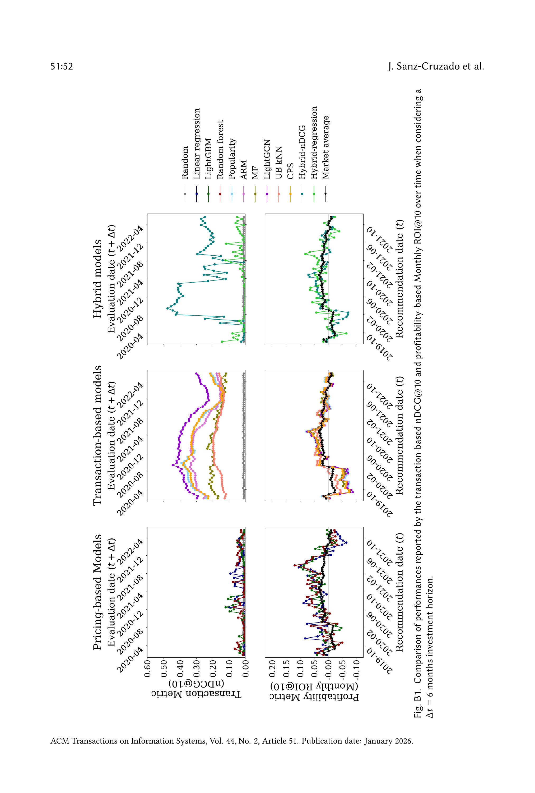

## C. Statistical Significance Tests

### C.1 Statistical Significance Test of Comparisons between Algorithms

We include in this section the statistical significance test results for our experiments in Section 9. Following the experimental procedure followed, for each date, we studied the statistical significance of our experiments by performing a two-sided Student's t-test with p-value p < 0.05. In order to account for multiple testing, we apply the Bonferroni correction.

Results are shown in Table C1, Table C2, Table C3 and Table C4. Each table shows the statistical significance results for a single metric (respectively, nDCG@10, monthly ROI@10, volatility@10 and %prof@10). On each table, every row and column represent an algorithm. For the ith row and the jth column, the value represented on the cell shows the fraction of dates on which the ith algorithm significantly beats the jth algorithm with respect to the number of times algorithm i beats algorithm j. For example, in Table C1, the first value (32/38) indicates that the random forest algorithm beats random recommendation 38 times, and, from them, the different is significant 32 times according to our statistical test. Bold cells indicate that 100% of the tests highlight significant value differences.

Colours in the tables represent the percentage of times on which a test is significant with respect to the number of wins. Red cells indicate that less than 50% of the tests correspond to a significant advantage, yellow cells indicate that between 50% and 75% of the metric differences are statistically significant, and green shows that more than 75% significant tests are positive. Darker colours indicate that the row algorithm outperforms the column algorithm at least in half of the dates (>30 times). Finally, white cells show that the row algorithm never outperforms the column algorithm with respect to the metric.

**Table C1: Statistical Significance Test Results for the nDCG@10 Metrics at 6 Months**

| | Random | Random forest | LightGBM | Linear regression | Popularity | LightGCN | ARM | MF | UB kNN | CPS | Hybrid-nDCG | Hybrid-regression |
|---|---|---|---|---|---|---|---|---|---|---|---|---|
| Random | - | 19/23 | 18/29 | 26/31 | 0/0 | 0/0 | 0/0 | 0/0 | 0/0 | 0/0 | 1/8 | 23/26 |
| Random forest | 32/38 | - | 28/40 | 31/37 | 0/0 | 0/0 | 0/0 | 0/0 | 0/0 | 0/0 | 5/7 | 26/33 |
| LightGBM | 23/32 | 17/21 | - | 31/37 | 0/0 | 0/0 | 0/0 | 0/0 | 0/0 | 0/0 | 4/6 | 25/31 |
| Linear regression | 23/30 | 14/24 | 20/24 | - | 0/0 | 0/0 | 0/0 | 0/0 | 0/0 | 0/0 | 2/2 | 22/29 |
| Popularity | **61/61** | **61/61** | **61/61** | **61/61** | - | 0/0 | 26/44 | 52/57 | **61/61** | 0/24 | 26/26 | **60/61** |
| LightGCN | **61/61** | **61/61** | **61/61** | **61/61** | 60/61 | - | **61/61** | **61/61** | **61/61** | **61/61** | 32/49 | **61/61** |
| ARM | **61/61** | **61/61** | **61/61** | **61/61** | 2/17 | 0/0 | - | 56/61 | **61/61** | 0/16 | 24/26 | **61/61** |
| MF | **61/61** | **61/61** | **61/61** | **61/61** | 0/4 | 0/0 | 0/0 | - | **61/61** | 0/1 | 17/18 | **60/61** |
| UB kNN | **61/61** | **61/61** | 60/61 | **61/61** | 0/0 | 0/0 | 0/0 | **0/0** | - | 0/0 | 11/13 | **56/58** |
| CPS | **61/61** | **61/61** | **61/61** | **61/61** | 0/37 | 0/0 | 27/45 | 55/60 | **61/61** | - | 26/26 | **61/61** |
| Hybrid-nDCG | 51/53 | 53/54 | 52/55 | 58/59 | **35/35** | 5/12 | **35/35** | 40/43 | 47/48 | **35/35** | - | 50/52 |
| Hybrid-regression | 32/35 | 24/28 | 27/30 | 26/32 | 0/0 | 0/0 | 0/0 | 0/0 | 0/0 | 3/3 | 0/0 | 9/9 | - |

**Table C2: Statistical Significance Test Results for the Monthly ROI@10 Metrics at 6 Months**

| | Random | Random forest | LightGBM | Linear regression | Popularity | LightGCN | ARM | MF | UB kNN | CPS | Hybrid-nDCG | Hybrid-regression |
|---|---|---|---|---|---|---|---|---|---|---|---|---|
| Random | - | 18/19 | 16/19 | **19/19** | 32/32 | 27/29 | 28/29 | 25/26 | 15/17 | 30/33 | 27/27 | 22/23 |
| Random forest | 42/42 | - | 27/28 | 32/33 | **40/40** | **41/41** | 39/40 | 37/38 | 39/40 | **40/40** | **35/35** | 36/37 |
| LightGBM | 42/42 | **33/33** | - | 32/32 | **36/36** | **37/37** | 38/39 | **40/40** | 35/37 | 37/37 | 36/36 | 36/36 |
| Linear regression | 41/42 | **28/28** | 29/29 | - | 35/36 | **36/36** | **37/37** | **37/37** | 35/37 | 36/37 | **37/37** | 37/38 |
| Popularity | 28/29 | 21/21 | 24/25 | 25/25 | - | 28/36 | **28/32** | 25/26 | 20/22 | 22/26 | 24/28 | 21/22 |
| LightGCN | 28/32 | **20/20** | 20/24 | 25/25 | 21/25 | - | 26/33 | 22/22 | **14/14** | **16/23** | 21/26 | 23/23 |
| ARM | 31/32 | 19/21 | 20/22 | 24/24 | 24/29 | 22/28 | - | 14/23 | 12/15 | 14/15 | 20/25 | 21/21 |
| MF | 33/35 | 22/23 | 19/21 | 24/24 | **32/35** | **39/39** | 30/38 | - | 19/20 | 26/28 | 31/33 | 21/22 |
| UB kNN | **44/44** | 20/21 | 23/24 | 22/24 | 39/39 | 45/47 | 43/46 | 39/41 | - | **41/41** | 36/37 | 29/29 |
| CPS | 27/28 | 21/21 | 23/24 | 24/24 | 32/35 | 33/38 | 39/46 | 31/33 | 18/20 | - | 28/34 | 22/24 |
| Hybrid-nDCG | 31/34 | 25/26 | **25/25** | 24/24 | 26/33 | 25/35 | 31/36 | 27/28 | 24/24 | 25/27 | - | 25/26 |
| Hybrid-regression | 37/38 | 23/24 | **25/25** | 23/23 | **39/39** | 36/38 | **40/40** | **39/39** | 29/32 | 35/37 | **35/35** | - |

**Table C3: Statistical Significance Test Results for the %prof@10 Metrics at 6 Months**

| | Random | Random forest | LightGBM | Linear regression | Popularity | LightGCN | ARM | MF | UB kNN | CPS | Hybrid-nDCG | Hybrid-regression |
|---|---|---|---|---|---|---|---|---|---|---|---|---|
| Random | - | 29/30 | **35/35** | 19/22 | 26/27 | **30/30** | 35/36 | 29/30 | 25/28 | 28/29 | 26/28 | 24/27 |
| Random forest | 30/31 | - | 35/35 | 24/26 | **23/23** | **32/32** | **36/36** | 33/35 | 29/32 | 32/34 | 29/30 | **25/25** |
| LightGBM | 24/26 | 24/26 | - | **18/18** | 21/22 | **24/24** | 27/27 | 24/25 | 23/26 | **23/23** | 24/24 | 23/23 |
| Linear regression | 35/39 | 34/35 | 42/43 | - | **31/31** | 35/36 | **37/37** | 36/37 | 37/38 | **35/35** | **36/36** | 34/35 |
| Popularity | 34/34 | 37/38 | 36/39 | **30/30** | - | 34/35 | **36/36** | 33/34 | 38/39 | 36/39 | 31/33 | 32/33 |
| LightGCN | 29/31 | 26/29 | 35/37 | 24/25 | 23/26 | - | 37/44 | 17/25 | 28/29 | 21/26 | **23/32** | 28/29 |
| ARM | 24/25 | 25/25 | 33/34 | 24/25 | 15/17 | - | **12/19** | **24/24** | 9/21 | 17/22 | **24/24** |
| MF | 28/31 | 25/26 | 35/36 | 23/24 | 23/27 | 28/36 | 36/42 | - | **29/31** | 26/29 | 25/33 | 23/26 |
| UB kNN | 31/33 | 27/29 | 34/35 | 22/23 | **22/22** | 29/32 | **35/37** | 27/30 | - | 23/24 | 24/28 | 26/27 |
| CPS | **32/32** | 26/27 | 36/38 | 25/26 | **22/22** | **32/35** | 36/40 | 24/31 | **32/37** | - | **25/33** | **28/28** |
| Hybrid-nDCG | 32/33 | 30/31 | 36/37 | 23/25 | 23/28 | 27/29 | 36/39 | 22/28 | 31/33 | 21/28 | - | **31/31** |
| Hybrid-regression | 32/34 | 35/36 | **38/38** | **28/28** | **31/31** | 35/37 | 33/35 | 32/34 | 32/33 | 29/30 | - |

**Table C4: Statistical Significance Test Results for the Volatility@10 Metrics at 6 Months**

| | Random | Random forest | LightGBM | Linear regression | Popularity | LightGCN | ARM | MF | UB kNN | CPS | Hybrid-nDCG | Hybrid-regression |
|---|---|---|---|---|---|---|---|---|---|---|---|---|
| Random | - | **61/61** | **61/61** | 60/60 | **61/61** | **61/61** | **61/61** | **61/61** | **61/61** | **61/61** | **61/61** | 51/51 |
| Random forest | 0/0 | - | 28/28 | 46/47 | **14/14** | 18/20 | 17/18 | **13/13** | 3/3 | **14/14** | 18/19 | 11/11 |
| LightGBM | 0/0 | **33/33** | - | 47/47 | **16/16** | 19/19 | **20/20** | 17/18 | 2/3 | 18/19 | 19/19 | 12/12 |
| Linear regression | 1/1 | **14/14** | **14/14** | - | 9/9 | **11/11** | 10/11 | 9/9 | 7/7 | 9/9 | **11/11** | 4/4 |
| Popularity | 0/0 | 47/47 | **45/45** | 52/52 | - | **61/61** | 53/54 | 44/49 | **30/30** | 49/49 | 52/52 | **36/36** |
| LightGCN | 0/0 | 40/41 | 41/42 | 49/50 | 0/0 | - | 34/42 | 9/15 | 14/16 | 0/2 | **21/32** | **32/32** |
| ARM | 0/0 | 42/43 | **41/41** | 50/50 | 0/7 | 13/19 | - | 2/6 | 3/4 | 0/0 | 17/18 | 27/31 |
| MF | 0/0 | 46/48 | **43/43** | 52/52 | 7/12 | 41/46 | 51/55 | - | 10/15 | 20/27 | 39/42 | **34/34** |
| UB kNN | 0/0 | **58/58** | **58/58** | 53/54 | 30/31 | 43/45 | 56/57 | 38/46 | - | 39/40 | 47/47 | 39/41 |
| CPS | 0/0 | 47/47 | **42/42** | 52/52 | 11/12 | **57/59** | **61/61** | 28/34 | 21/21 | - | **48/51** | **35/35** |
| Hybrid-nDCG | 0/0 | **42/42** | **42/42** | **50/50** | 9/9 | 19/29 | 39/43 | 14/19 | 13/14 | 8/10 | - | 31/32 |
| Hybrid-regression | 10/10 | 49/50 | 47/49 | 57/57 | 25/25 | 28/29 | **30/30** | 26/27 | 19/20 | **26/26** | **29/29** | - |

### C.2 Statistical Significance Test of Pearson Correlations

We also include the statistical significance test results for the Pearson correlations between metrics shown in Figures 4, 7, 12 and 13. These tests aim to check whether the correlation is different than 0.0. For this, we perform a Student's t-test with p-value p < 0.05. Table C5 shows the p-values for the Pearson correlation values shown in Figure 4(b). As we can show, for most of the comparisons (except for the comparison between nDCG@10 and %prof@10), the Pearson correlation is significantly different than 0: indicating that there is a linear relation between the metrics. Table C6 shows the equivalent table for the experiments with synthetic users (correlations shown in Figure 7(b)).

**Table C5: p-Values for the Pearson Correlation Values Shown in Figure 4(b)**

| | nDCG@10 | Monthly ROI@10 | %prof@10 | Volatility@10 |
|---|---|---|---|---|
| nDCG@10 | 0.00 | | | |
| Monthly ROI@10 | 0.00 | 0.00 | | |
| %prof@10 | 0.11 | 0.00 | 0.00 | |
| Volatility@10 | 0.00 | 0.00 | 0.00 | 0.00 |

**Table C6: p-Values for the Pearson Correlation Values for the Synthetic Users Experiment Shown in Figure 7(b)**

| | nDCG@10 | Monthly ROI@10 | %prof@10 | Volatility@10 |
|---|---|---|---|---|
| nDCG@10 | 0.00 | | | |
| Monthly ROI@10 | 0.00 | 0.00 | | |
| %prof@10 | 0.0 | 0.00 | 0.00 | |
| Volatility@10 | 0.00 | 0.00 | 0.00 | 0.00 |

Figure C1 further shows that the p-values for the statistical tests of the Pearson correlation between nDCG@10 and Monthly ROI@10 are all lower than 0.05 for the different investment horizons tested in Section 11. Finally, Figure C2 illustrates whether the Pearson correlations over time illustrated in Figure 13 are significantly different than 0.

**Figure C1: p-values for the Pearson correlation at different investment horizons (see Figure 12).**

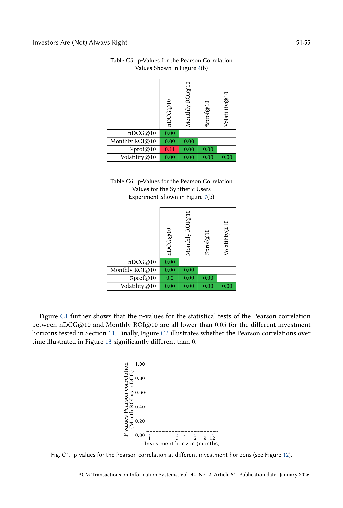

**Figure C2: p-values of the Pearson correlation between monthly ROI@10 and nDCG@10 for different time horizons, divided by date (matching Figure 13).**

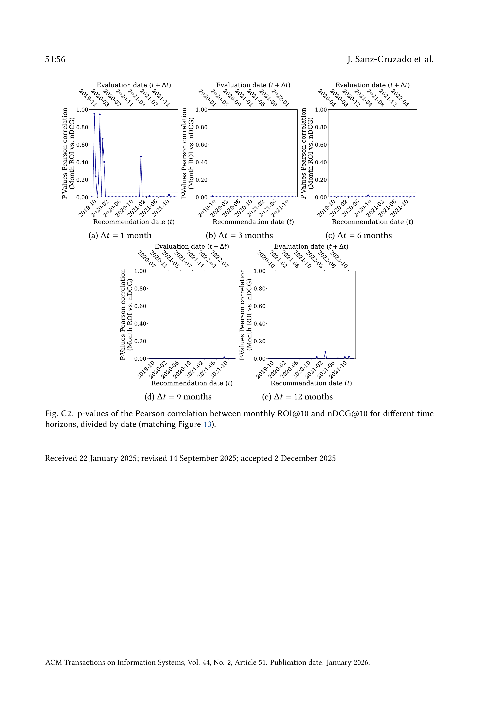

---

Received 22 January 2025; revised 14 September 2025; accepted 2 December 2025
