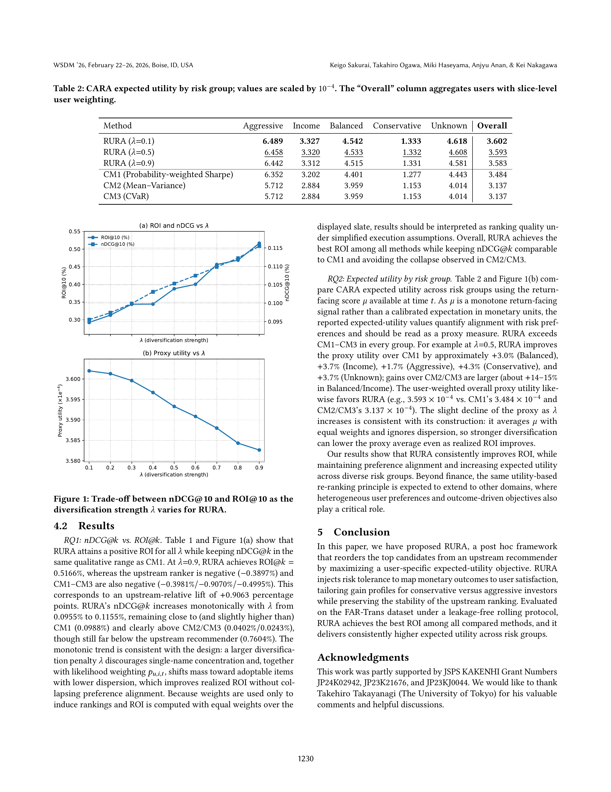

# Risk-Aware Utility Re-Ranking for Financial Asset Recommendation

**Authors:** Keigo Sakurai (Hokkaido University), Takahiro Ogawa (Hokkaido University), Miki Haseyama (Hokkaido University), Anjyu Anan (Nomura Asset Management Co., Ltd. / Kobe University), Kei Nakagawa (Osaka Metropolitan University)

**Contact:** sakurai@lmd.ist.hokudai.ac.jp, ogawa@lmd.ist.hokudai.ac.jp, mhaseyama@lmd.ist.hokudai.ac.jp, an2anju555@gmail.com, kei.nak.0315@gmail.com

---

## Abstract

A financial recommender system couples two objectives: ranking for preference alignment so that users actually adopt the recommendations, and ranking for outcome quality so that adoption translates into value. These objectives can conflict: return-driven lists may narrow diversification and miss user tastes, while relevance-only lists deliver weak realized returns. To address these problems, we propose Risk-aware Utility re-Ranking (RURA), a plug-in method that operates on the upstream top candidates and optimizes a user-specific expected-utility objective. RURA injects investor risk tolerance into the utility, includes a likelihood-aware variant that integrates calibrated adoption probabilities, and uses a single hyperparameter to control diversification to preserve upstream order while trading minimal nDCG loss for ROI gains. Experiments on a real-world dataset demonstrate that RURA outperforms risk-aware baselines in ROI while keeping nDCG within the range of a strong risk-aware baseline and delivering higher expected utility across risk groups.

**CCS Concepts:** Information systems: Content ranking; Personalization.

**Keywords:** Financial asset recommendation; utility-aware ranking; re-ranking.

## 1. Introduction

The expansion of retail investing and the mainstream adoption of online trading have heightened the need for personalized financial asset recommendations [1, 3, 6, 7, 11, 16, 19]. In the finance domain, downstream recommendation results directly affect monetary returns (e.g., ROI), so optimizing only preference-alignment metrics common in web recommendation (e.g., click or view-based nDCG) is insufficient. At the same time, if preference alignment is not adequately maintained, users are less likely to adopt (i.e., purchase) the recommendations, diminishing system value before any investment outcomes materialize [2, 9, 10, 12]. Therefore, financial asset recommendations must jointly consider the preference alignment necessary for adoption and the return-oriented performance that leads to gains.

However, two unresolved challenges remain in this domain: (A) the trade-off between preference alignment and return performance, and (B) the heterogeneity of investors' risk preferences. First, the two objectives (preference alignment and return performance) do not move in lockstep: improving one often degrades the other [4, 13]. Price or return-driven ranking can weaken diversification and overlook user tastes, whereas preference-only ranking may increase adoption but depress realized returns; a well-calibrated balance is therefore required. Second, while aggressive investors tend to prefer higher-return, higher-volatility assets, conservative investors prioritize stability [5, 8]. Prior works [4, 13, 21, 22] have not sufficiently personalized recommendations to reflect this risk tolerance.

To address the above challenges, we acknowledge the inherent trade-off between preference alignment and return performance, formulate a re-ranking task to improve returns with minimal loss of preference alignment, and propose Risk-aware Utility re-Ranking (RURA) as a concrete solution. RURA takes the top candidates produced by an upstream recommendation model optimized for preference alignment and reorders them to maximize an expected-utility function parameterized by the user's risk tolerance. The utility function, standard in finance, maps outcome distributions to user satisfaction; for example, small losses yield only minor utility reductions for aggressive investors but substantially reduce utility for conservative investors. By maximizing expected utility, RURA recommends assets whose gain profiles are tailored to each investor's risk tolerance. Moreover, by presenting items in descending order of the re-ranking score, RURA preserves the stability of the original ranking, and a hyperparameter enables continuous control over the trade-off between nDCG degradation and ROI improvement.

## 2. Task Definition

We formalize re-ranking for financial asset recommendation under temporal evaluation. For each user $u$ and evaluation slice $t$ (e.g., a trading period), an upstream recommender produces a candidate set $C_{u,t} = \{i_1, \ldots, i_L\}$ of size $L$ with per-item signals. Our system re-ranks only within $C_{u,t}$; no new items are introduced, and the upstream model remains unchanged. The goal is to improve return-oriented performance while keeping the loss in preference alignment small, where alignment is measured by binary nDCG@k computed against new-purchase labels in the test window (not against the upstream order).

*Inputs.* (i) Candidate set $C_{u,t}$ with item-wise signals ($\mu_{u,i,t}, \sigma_{u,i,t}$). The quantity $\mu_{u,i,t}$ is a return-facing score available at time $t$ (priority: blended upstream score; otherwise channel-specific scores). The quantity $\sigma_{u,i,t} \geq 0$ is a per-item volatility proxy computed from prices strictly before $t$; when unavailable, we use a diagonal surrogate by imputing slice-level medians to ensure non-negativity. Optional adoption likelihoods $p_{u,i,t} \in [0, 1]$ calibrated on validation may also be provided.
(ii) User profiles providing a positive scalar risk aversion parameter $\rho_u > 0$ (mapped from profiles or coarse risk buckets; higher tolerance corresponds to smaller $\rho_u$) and a user-specific utility scale $B_u > 0$.

*Outputs.* Nonnegative display weights $w_{u,i,t}$ for $i \in C_{u,t}$ satisfying $\sum_i w_{u,i,t} \leq 1$; the shown ranking is the descending order of $w_{u,i,t}$, and the top-$k$ items are presented.

## 3. Proposed Method: RURA

RURA re-ranks, for each user $u$ and evaluation slice $t$, only the fixed candidate set $C_{u,t} = \{i_1, \ldots, i_L\}$ produced by the upstream recommender at time $t$. All signals are strictly time-aligned: the return-facing score $\mu_{u,i,t}$ and dispersion proxy $\sigma_{u,i,t}$ use data prior to $t$; adoption likelihoods $p_{u,i,t}$ are calibrated on $[t, t+\Delta]$ and then held fixed for testing on $[t+\Delta, t+2\Delta]$. No information from $[t, \infty)$ is used for construction. The learned weights serve only to induce an ordering, and the displayed top-$k$ is evaluated with equal weights as described in Section 4.1.

### 3.1 Personalized utility via risk preferences

Each user $u$ has a base risk-aversion coefficient $\rho_u^{(0)}$ estimated from profile signals (or coarse risk buckets). Heterogeneity is modeled by an ordinal group $g(u) \in G$ with group-specific positive scale $s_{g(u)}$, and

$$
\rho_u = s_{g(u)} \rho_u^{(0)}, \quad \text{with } s_{g_1} \geq s_{g_2} \geq \cdots \geq s_{g_{|G|}} > 0. \tag{1}
$$

Smaller $\rho_u$ corresponds to higher risk tolerance. We adopt the constant-absolute-risk-aversion (CARA) form [15] $u_\rho(x) = 1 - \exp(-\rho x)$, which increases with outcome $x$ and penalizes downside more strongly as $\rho$ grows.

For each item $i$ and slice $t$, $\mu_{u,i,t}$ denotes a return-facing signal available at $t$. It is monotone in expected return but not calibrated in currency units; any "expected-utility" quantity built from $\mu$ is therefore a proxy for risk-preference alignment rather than monetary utility. The dispersion proxy $\sigma_{u,i,t} \geq 0$ is computed from pre-$t$ prices; when unavailable, we impute slice-level medians to maintain nonnegativity, which attenuates cross-sectional dispersion. We use a user-specific positive scale $B_u$ carried over from profiles, and item-level adoption likelihoods $p_{u,i,t} \in [0, 1]$ fitted on the validation window and then frozen for testing.

### 3.2 Objective and constraints

For each $(u, t)$, RURA selects nonnegative display weights on the normalized simplex

$$
\Delta = \{\mathbf{w} \in \mathbb{R}_{\geq 0}^L : \mathbf{1}^\top \mathbf{w} \leq 1\}. \tag{2}
$$

The leftover mass $1 - \sum_i w_{u,i,t}$ represents a cash option within the optimization, consistent with classical separation results. We use a likelihood-aware diagonal-risk program:

$$
\max_{\{w_{u,i,t}\}} \sum_{i \in C_{u,t}} \left( p_{u,i,t} B_u \mu_{u,i,t} w_{u,i,t} - \frac{\rho_u}{2} p_{u,i,t} B_u^2 \sigma_{u,i,t}^2 w_{u,i,t}^2 \right) - \lambda \sum_{i \in C_{u,t}} w_{u,i,t}^2 \tag{3}
$$

$$
\text{s.t.} \quad \sum_i w_{u,i,t} \leq 1, \quad w_{u,i,t} \geq 0.
$$

The linear term rewards higher return-facing signals; the quadratic term penalizes risk in proportion to user aversion $\rho_u$; the $\lambda > 0$ term discourages single-name concentration. Our risk term operationalizes a mean-variance trade-off in the spirit of classical portfolio selection [14]. A covariance-enabled variant replaces $\sum_i \sigma_{u,i,t}^2 w_{u,i,t}^2$ with $\mathbf{w}^\top \Sigma_{u,t} \mathbf{w}$; experiments use the diagonal setting $\Sigma_{u,t} = \text{diag}(\sigma_{u,i,t}^2)$. During evaluation, learned weights induce the ordering only; the displayed ranking is the descending order of $w_{u,i,t}$, and only the top-$k$ items are presented.

### 3.3 Solver and output ranking

Problem (3) is strictly concave on a convex simplex. Under the diagonal-risk approximation, it admits a water-filling solution. Define

$$
a_i := p_{u,i,t} B_u \mu_{u,i,t}, \qquad b_i := \frac{\rho_u}{2} p_{u,i,t} B_u^2 \sigma_{u,i,t}^2 + \lambda, \tag{4}
$$

then the optimal weights take the form

$$
w_{u,i,t}^\star = \max\left\{ 0, \frac{a_i - \tau}{2 b_i} \right\}, \tag{5}
$$

where the scalar threshold $\tau$ is chosen so that $\sum_i w_{u,i,t}^\star \leq 1$, with equality when the budget constraint is active. The threshold is found by a monotone search in $O(L \log L)$. The final display ranks items by $w_{u,i,t}^\star$ and presents the top-$k$.

## 4. Experiments

We address two research questions:

- **RQ1:** Can RURA improve return-oriented performance while keeping losses in preference alignment (nDCG@k) small?
- **RQ2:** Does injecting user risk tolerance into the utility lead to systematically higher expected utility?

The code is available at: <https://github.com/kyomusso/RURA>.

### 4.1 Experimental settings

*Dataset.* We use the public FAR-Trans dataset [18] spanning January 2018: November 2022, pairing de-identified investor-asset transactions with daily price series and customer profiles. To the best of our knowledge, FAR-Trans is the only dataset that jointly provides transaction data, price data, and the risk-tolerance information. The corpus includes 29,090 customers, 388,049 transactions, and 806 assets; asset classes cover equities, bonds, and mutual funds, with 321 assets exhibiting at least one transaction. Profiles provide bank-assessed risk categories (Conservative, Income, Balanced, Aggressive) from a MiFID-II compliant questionnaire; users without a label are grouped as Unknown. Assets lacking valid start or end closes inside any evaluation window are excluded from that window for all methods to ensure comparability. All slice-$t$ features are constructed using data strictly before $t$. Volatility proxies $\sigma$ are computed from pre-$t$ prices; missing values are imputed by slice-level medians to maintain nonnegativity and avoid spurious dispersion gaps. Returns are based on close-to-close data and should be read as backtested outcomes under this pricing convention.

*Evaluation Protocol.* We use rolling slices every eight weeks from 2019-08-01 to 2021-11-18 with horizon $\Delta = 6$ months. For each user $u$ and slice $t$: (i) construction uses data $< t$; (ii) validation $[t, t+\Delta]$ fits adoption calibrators (isotonic regression) and selects hyperparameters; (iii) testing $[t+\Delta, t+2\Delta]$ evaluates final models. Slices are strictly time-ordered without shuffling; overlaps arise from the rolling design and do not introduce leakage because calibrators and hyperparameters are frozen before testing. Candidates are the upstream top-$M$ per $(u, t)$ with deterministic tie-breaking; items already held at $t$ are excluded to target new purchases. The re-ranking stage operates within $C_{u,t}$ using a shortlist $L = 30$ and slate size $k = 10$. Assets without valid prices in a test window are excluded from that window for all methods. After validation, the same hyperparameters are used across overlapping slices, and random seeds and tie-breaking are fixed for reproducibility.

*Baselines.* All comparative methods (CMs) operate post hoc on the same candidate sets $C_{u,t}$, exclude items already held at $t$, and share $k = 10$, $L = 30$, and the rolling protocol above. No retraining of the upstream model is performed. All methods are evaluated under the same assumptions. As a production-style benchmark, we first consider the upstream recommender: items are ranked by the upstream blended score, and the top-$k$ are displayed with uniform slate weights. This setting reflects the ranking deployed in practice, absent any post hoc risk adjustment. We then compare against three widely used risk-return heuristics that cover complementary design points:

**CM1: Probability-weighted Sharpe [20].** Each item receives a Sharpe-style score that combines adoption likelihood, the return-facing signal, and inverse volatility. The top-$k$ by this score are selected, and static display weights are set proportional to the scores and renormalized to sum to one; these weights induce the ranking. This baseline reflects a simple, high-precision heuristic that favors high-$\mu$, low-$\sigma$ items adjusted for adoption.

**CM2: Mean-variance optimization [14].** A nonnegative, unit-sum mean-variance program is solved on the candidate subset using a diagonal covariance built from per-item dispersion proxies. The solution is obtained by projected updates on the simplex, and the learned weights induce the ranking. For fairness, the risk aversion and scaling follow the same $\rho_u$ and $B_u$ construction used for RURA.

**CM3: Conditional Value at Risk (CVaR)-focused portfolio [17].** A downside-risk objective minimizes Gaussian CVaR with a confidence level $\alpha = 0.95$ under the same diagonal risk and nonnegative, unit-sum constraints. Projected updates yield weights that determine the ranking. This baseline emphasizes tail protection and serves as a complementary risk-focused comparator to CM2.

*Evaluation Metrics.* We report two primary metrics and a diagnostic expected-utility measure. Unless noted here, all quantities are computed per user and slice, and then averaged over slices with user weighting. Returns are not annualized.

**nDCG@k (preference alignment).** Binary relevance is defined by new purchases in the test window; nDCG@k is computed on the top-$k$ ranking for each user using these labels. We report nDCG@k as percentages.

**ROI@k (return performance).** We compute the realized period return of the recommended slate using start/end closes from the test window. With equal display weights $w_i = 1/k$ for the top-$k$ items, the per-user return is

$$
\text{ROI@}k(u, t) = \sum_{i \in \text{top-}k(u,t)} w_i \left( \frac{P_{i,t}^{\text{end}}}{P_{i,t}^{\text{start}}} - 1 \right) - f \sum_{i \in \text{top-}k(u,t)} w_i, \tag{6}
$$

where $P_{i,t}^{\text{start}}$ and $P_{i,t}^{\text{end}}$ are the asset's start and end closes in the test window, and the total friction $f = (\text{fees\_bps\_buy} + \text{fees\_bps\_sell} + \text{slippage\_bps})/10{,}000$. We set $\text{fees\_bps\_buy} = \text{fees\_bps\_sell} = 10$, and $\text{slippage\_bps} = 10$, so $f = 0.003$. Reported ROI values are in percent.

**Expected utility@k (risk alignment).** To quantify alignment with user risk preferences, we use the CARA form $u_\rho(x) = 1 - \exp(-\rho x)$. For user $u$ at slice $t$, let $\rho_u > 0$ be the risk aversion mapped from profiles with category-based scaling, and let $\mu_{u,i,t}$ be the return-facing signal available at time $t$. The proxy expected-utility score is

$$
\text{EU}_u(t)@k = \frac{1}{k} \sum_{i \in \text{top-}k(u,t)} \left[ 1 - \exp(-\rho_u \mu_{u,i,t}) \right], \tag{7}
$$

which reflects risk-preference alignment rather than monetary utility because $\mu$ is not calibrated in currency units. We report overall means and group-wise breakdowns by risk category.

### 4.2 Results

**Table 1: Test-set nDCG@10 and ROI@10 (%). Bold indicates the best value and underline indicates the second best among RURA and CMs.**

| Method | nDCG@10 (%) | ROI@10 (%) |
|---|---|---|
| Upstream recommender | 0.7604 | -0.3897 |
| RURA ($\lambda = 0.1$) | 0.0955 | 0.2924 |
| RURA ($\lambda = 0.5$) | 0.1053 | 0.3878 |
| RURA ($\lambda = 0.9$) | **0.1155** | **0.5166** |
| CM1 (Probability-weighted Sharpe) | 0.0988 | -0.3981 |
| CM2 (Mean-Variance) | 0.0402 | -0.9070 |
| CM3 (CVaR) | 0.0243 | -0.4995 |

**Table 2: CARA expected utility by risk group; values are scaled by $10^{-4}$. The "Overall" column aggregates users with slice-level user weighting.**

| Method | Aggressive | Income | Balanced | Conservative | Unknown | **Overall** |
|---|---|---|---|---|---|---|
| RURA ($\lambda = 0.1$) | **6.489** | **3.327** | **4.542** | **1.333** | **4.618** | **3.602** |
| RURA ($\lambda = 0.5$) | 6.458 | 3.320 | 4.533 | 1.332 | 4.608 | 3.593 |
| RURA ($\lambda = 0.9$) | 6.442 | 3.312 | 4.515 | 1.331 | 4.581 | 3.583 |
| CM1 (Probability-weighted Sharpe) | 6.352 | 3.202 | 4.401 | 1.277 | 4.443 | 3.484 |
| CM2 (Mean-Variance) | 5.712 | 2.884 | 3.959 | 1.153 | 4.014 | 3.137 |
| CM3 (CVaR) | 5.712 | 2.884 | 3.959 | 1.153 | 4.014 | 3.137 |

**Figure 1: Trade-off between nDCG@10 and ROI@10 as the diversification strength $\lambda$ varies for RURA.**

*RQ1: nDCG@k vs. ROI@k.* Table 1 and Figure 1(a) show that RURA attains a positive ROI for all $\lambda$ while keeping nDCG@k in the same qualitative range as CM1. At $\lambda = 0.9$, RURA achieves ROI@k = 0.5166%, whereas the upstream ranker is negative (-0.3897%) and CM1-CM3 are also negative (-0.3981%, -0.9070%, -0.4995%). This corresponds to an upstream-relative lift of +0.9063 percentage points. RURA's nDCG@k increases monotonically with $\lambda$ from 0.0955% to 0.1155%, remaining close to (and slightly higher than) CM1 (0.0988%) and clearly above CM2/CM3 (0.0402%/0.0243%), though still far below the upstream recommender (0.7604%). The monotonic trend is consistent with the design: a larger diversification penalty $\lambda$ discourages single-name concentration and, together with likelihood weighting $p_{u,i,t}$, shifts mass toward adoptable items with lower dispersion, which improves realized ROI without collapsing preference alignment. Because weights are used only to induce rankings and ROI is computed with equal weights over the displayed slate, results should be interpreted as ranking quality under simplified execution assumptions. Overall, RURA achieves the best ROI among all methods while keeping nDCG@k comparable to CM1 and avoiding the collapse observed in CM2/CM3.

*RQ2: Expected utility by risk group.* Table 2 and Figure 1(b) compare CARA expected utility across risk groups using the return-facing score $\mu$ available at time $t$. As $\mu$ is a monotone return-facing signal rather than a calibrated expectation in monetary units, the reported expected-utility values quantify alignment with risk preferences and should be read as a proxy measure. RURA exceeds CM1-CM3 in every group. For example at $\lambda = 0.5$, RURA improves the proxy utility over CM1 by approximately +3.0% (Balanced), +3.7% (Income), +1.7% (Aggressive), +4.3% (Conservative), and +3.7% (Unknown); gains over CM2/CM3 are larger (about +14-15% in Balanced/Income). The user-weighted overall proxy utility likewise favors RURA (e.g., $3.593 \times 10^{-4}$ vs. CM1's $3.484 \times 10^{-4}$ and CM2/CM3's $3.137 \times 10^{-4}$). The slight decline of the proxy as $\lambda$ increases is consistent with its construction: it averages $\mu$ with equal weights and ignores dispersion, so stronger diversification can lower the proxy average even as realized ROI improves.

Our results show that RURA consistently improves ROI, while maintaining preference alignment and increasing expected utility across diverse risk groups. Beyond finance, the same utility-based re-ranking principle is expected to extend to other domains, where heterogeneous user preferences and outcome-driven objectives also play a critical role.

## 5. Conclusion

In this paper, we have proposed RURA, a post hoc framework that reorders the top candidates from an upstream recommender by maximizing a user-specific expected-utility objective. RURA injects risk tolerance to map monetary outcomes to user satisfaction, tailoring gain profiles for conservative versus aggressive investors while preserving the stability of the upstream ranking. Evaluated on the FAR-Trans dataset under a leakage-free rolling protocol, RURA achieves the best ROI among all compared methods, and it delivers consistently higher expected utility across risk groups.

## Acknowledgments

This work was partly supported by JSPS KAKENHI Grant Numbers JP24K02942, JP23K21676, and JP23KJ0044. We would like to thank Takehiro Takayanagi (The University of Tokyo) for his valuable comments and helpful discussions.

## References

- **[1]** Baptiste Barreau and Laurent Carlier. 2020. History-augmented collaborative filtering for financial recommendations. In *Proceedings of the ACM Conference on Recommender Systems*. 492-497.
- **[2]** Utpal Bhattacharya, Andreas Hackethal, Simon Kaesler, Benjamin Loos, and Steffen Meyer. 2012. Is unbiased financial advice to retail investors sufficient? Answers from a large field study. *The Review of Financial Studies* 25, 4 (2012), 975-1032.
- **[3]** Jun Chang, Wenting Tu, Changrui Yu, and Chuan Qin. 2021. Assessing dynamic qualities of investor sentiments for stock recommendation. *Information Processing and Management* 58, 2 (2021), 102452.
- **[4]** Munki Chung, Junhyeong Lee, Yongjae Lee, and Woo Chang Kim. 2025. Mean variance efficient collaborative filtering for stock recommendations. In *Proceedings of the ACM International Conference on AI in Finance*. 806-813.
- **[5]** Rama Cont. 2001. Empirical properties of asset returns: stylized facts and statistical issues. *Quantitative Finance* 1, 2 (2001), 223.
- **[6]** Chunjing Gan, Binbin Hu, Bo Huang, Tianyu Zhao, Yingru Lin, Wenliang Zhong, Zhiqiang Zhang, Jun Zhou, and Chuan Shi. 2023. Which matters most in making fund investment decisions? A multi-granularity graph disentangled learning framework. In *Proceedings of the 46th International ACM SIGIR Conference on Research and Development in Information Retrieval*. 2516-2520.
- **[7]** Ashraf Ghiye, Baptiste Barreau, Laurent Carlier, and Michalis Vazirgiannis. 2023. Adaptive collaborative filtering with personalized time decay functions for financial product recommendation. In *Proceedings of the ACM Conference on Recommender Systems*. 798-804.
- **[8]** John Grable and Ruth H Lytton. 1999. Financial risk tolerance revisited: the development of a risk assessment instrument. *Financial Services Review* 8, 3 (1999), 163-181.
- **[9]** Yoontae Hwang, Yongjae Lee, and Frank J Fabozzi. 2023. Identifying household finance heterogeneity via deep clustering. *Annals of Operations Research* 325, 2 (2023), 1255-1289.
- **[10]** Yoontae Hwang, Junpyo Park, Jang Ho Kim, Yongjae Lee, and Frank J Fabozzi. 2024. Heterogeneous trading behaviors of individual investors: A deep clustering approach. *Finance Research Letters* 65 (2024), 105481.
- **[11]** Mao Kang, Ye Bi, Zhenyu Wu, Jianming Wang, and Jing Xiao. 2019. A Heterogeneous Conversational Recommender System for Financial Products. In *Knowledge-aware and Conversational Recommender Systems Workshop at the Conference on Information and Knowledge Management*. 26-30.
- **[12]** MirZat Ullah Khan. 2017. Impact of availability bias and loss aversion bias on investment decision making, moderating role of risk perception. *Management and Administration* 1, 1 (2017), 17-28.
- **[13]** Younghin Lee, Yejin Kim, Javier Sanz-Cruzado, Richard McCreadie, and Yongjae Lee. 2024. Stock recommendations for individual investors: A temporal graph network approach with mean-variance efficient sampling. In *Proceedings of the ACM International Conference on AI in Finance*. 795-803.
- **[14]** Harry Markowitz. 1952. Portfolio selection. *The Journal of Finance* 7, 1 (1952), 77-91.
- **[15]** John W Pratt. 1978. Risk aversion in the small and in the large. In *Uncertainty in Economics*. Elsevier, 59-79.
- **[16]** Ke Ren and Avinash Malik. 2019. Investment recommendation system for low-liquidity online peer to peer lending (P2PL) marketplaces. In *Proceedings of the ACM International Conference on Web Search and Data Mining*. 510-518.
- **[17]** R Tyrrell Rockafellar, Stanislav Uryasev, et al. 2000. Optimization of conditional value-at-risk. *Journal of Risk* 2 (2000), 21-42.
- **[18]** Javier Sanz-Cruzado, Nikolaos Droukas, and Richard McCreadie. 2024. FAR-Trans: An investment dataset for financial asset recommendation. In *Proceedings of the IJCAI Workshop on Recommender Systems in Finance*.
- **[19]** Javier Sanz-Cruzado, Richard McCreadie, Nikolaos Droukas, Craig Macdonald, and Iadh Ounis. 2022. On transaction-based metrics as a proxy for profitability of financial asset recommendations. In *Proceedings of the International Workshop on Personalization and Recommender Systems in Financial Services*.
- **[20]** William F Sharpe. 1998. The sharpe ratio. Streetwise: the Best of the Journal of Portfolio Management 3, 3 (1998), 169-85.
- **[21]** Takehiro Takayanagi, Chung-Chi Chen, and Kiyoshi Izumi. 2023. Personalized dynamic recommender system for investors. In *Proceedings of the International ACM SIGIR Conference on Research and Development in Information Retrieval*. 2246-2250.
- **[22]** Takehiro Takayanagi, Kiyoshi Izumi, Atsuo Kato, Naoyuki Tsunedomi, and Yukina Abe. 2023. Personalized stock recommendation with investors' attention and contextual information. In *Proceedings of the International ACM SIGIR Conference on Research and Development in Information Retrieval*. 3339-3343.
